# NetSherlock: AI 驱动的智能网络诊断平台


## 1. 设计概述

### 1.1 从工具集到智能平台

NetSherlock 项目的核心动机是解决一个实际矛盾：**我们已经拥有了 65+ 个覆盖全链路的 eBPF 网络测量工具（troubleshooting-tools），但工具能力越全面，使用复杂度越高**。一线运维人员需要同时掌握工具选择、参数配置、协调执行时序（如 receiver-first 约束）和多层结果解读——这些都是高度依赖专家经验的操作。

我们的目标是将分层诊断方法论编码为 AI Agent 的控制逻辑，实现 **"输入告警/配置 → 输出诊断报告"** 的端到端自动化，让工具能力保持不变的同时，彻底革新交互方式。

项目经历了从手动工具到智能平台的演进，以下是完整的进化全景：

```
Stage 0          Stage 1           Stage 2           Stage 3
────────         ────────          ────────          ────────
65+ eBPF 工具    10 Skills         智能编排           自主诊断
手动操作         自动执行           条件分支           ReAct Agent
专家经验         知识固化           LLM 辅助           自主决策
高认知负担       低使用门槛         人机协作           零干预

troubleshooting  NetSherlock       NetSherlock       NetSherlock
-tools           Phase 1           Phase 2           Phase 3

<────── 能力不变，交互革新 ──────>
<────── 工具层复用，控制层演进 ──────>
```

**当前状态**：Stage 1（Phase 1）已完成，Stage 2 的基础已具备。具体而言：

- **Stage 0 → Stage 1** 已完成：65+ 个底层工具被封装为 10 个可复用的 Skill，由 ControllerEngine 确定性编排，支持 5 种诊断工作流，覆盖 VM 和 System 网络的延迟/丢包场景。Webhook 集成 Alertmanager 实现告警自动触发完整端到端诊断，或通过 api 手动触发特定类型测量诊断。
- **Stage 1 → Stage 2** 基础就绪：Interactive 模式的 Checkpoint 机制和 LLM 建议引擎框架已实现（当前为规则驱动），OrchestratorEngine（ReAct）的 Agent 框架和工具层已就绪。后续可在此基础上引入 LLM 分析驱动的智能建议和多层递归诊断。

三个核心价值维度贯穿整个演进过程：

1. **降低使用门槛**：从 "需要理解 65+ 个工具" 到 "描述问题即可触发诊断"
2. **知识可复制**：专家的诊断经验编码在 Skill 定义和工作流编排中，团队共享
3. **闭环自动化**：监控告警 → 自动诊断 → 报告生成 → 推荐修复，完成可观测性闭环

### 1.2 设计原则

整个系统的设计遵循四个核心原则：

- **Skill 驱动**：将领域知识封装为可复用的诊断过程（Skill），而非让 AI 直接操作底层工具。每个 Skill 内部包含完整的协调逻辑（如 receiver-first 时序约束、8 点位 BPF 部署），编排层只需按名称调用 Skill 即可。选择这样设计是因为底层工具的操作复杂度不应暴露给编排引擎——无论是确定性 Controller 还是 ReAct Agent。
- **分层解耦**：L1-L4 各层通过明确的输入/输出契约连接，可独立演进。L2 拓扑采集的结果通过结构化映射转化为 L3 测量工具的参数，L3 的测量日志又作为 L4 分析的输入。层间依赖清晰、可测试。
- **渐进智能化**：确定性编排 → LLM 辅助 → 自主 Agent，按需演进而非一步到位。我们在 Phase 1 选择了 ControllerEngine（确定性编排）作为生产引擎，同时保留了 OrchestratorEngine（ReAct）的框架。这是有意为之——在诊断类型有限（2-3 种）时，确定性编排的可靠性和可调试性远优于 LLM 自主决策。
- **Context 结构化**：系统处理两层 Context，每层都能独立构成 ReAct 闭环。

  **Layer 1 Context**（已有监控数据的结构化组织）本身就能驱动有价值的排查闭环。以系统网络高延迟告警为例：Agent 收到 `host_network_ping_time_ns > 5ms` 告警 → 结合"系统网络路径经过 OVS internal port → OVS kernel datapath → 物理网卡"的结构化知识，判断需要查看路径上各模块的指标 → 查询 `openvswitch_ovs_upcall_count`（OVS upcall 频率）和 `node_network_transmit_errs_total`（物理网卡错误） → 发现 OVS upcall 计数器激增 → 进一步查询 `ovs-vswitchd` 进程 CPU 使用率和 flow table 相关日志 → 初步判定 OVS 慢路径导致延迟，建议检查 flow table 规则或直接进入 Layer 2 的 `ovs_upcall_latency_summary` 深度测量。这个过程中，每一步"查什么指标"的决策都依赖于结构化的领域知识（网络类型→路径→模块→对应指标→解读方式）——这正是 Layer 1 Context 组织要解决的核心问题。

  **Layer 2 Context**（深度测量数据）通过 L2 环境采集和 L3 eBPF 工具部署主动获取——提供微秒级延迟分布、内核调用栈等 Layer 1 无法触及的深层信息。当 Layer 1 闭环无法精确定位根因时（如"延迟在发送端内部，但不知道是 vhost 还是 OVS"），Layer 2 的 eBPF 测量工具提供逐模块微秒级数据。

  当前实现中，Layer 1 闭环体现在 Controller 的 L1 阶段和工作流路由（查询监控 → 分类 → WORKFLOW_TABLE 查表），Layer 2 闭环体现在 Skill 内部（拓扑采集 → 工具部署 → 数据收集 → 分析归因）。Skill 封装的本质就是将领域知识结构化为模型可用的 context（详见需求文档 §1.2）。

### 1.3 智能化的必要性与目标

**核心目标**：将分层诊断方法论编码为 AI Agent 的控制逻辑，实现 **"输入告警/配置 → 输出诊断报告"** 的端到端自动化。


**三个价值维度**：

1. **降低使用门槛**：从 "需要理解 65+ 个工具" 到 "描述问题即可触发诊断"
2. **知识可复制**：专家的诊断经验编码在 Skill 定义和工作流编排中，团队共享
3. **闭环自动化**：监控告警 → 自动诊断 → 报告生成 → 推荐修复，完成可观测性闭环

---

## 2. 系统架构

### 2.1 整体分层架构

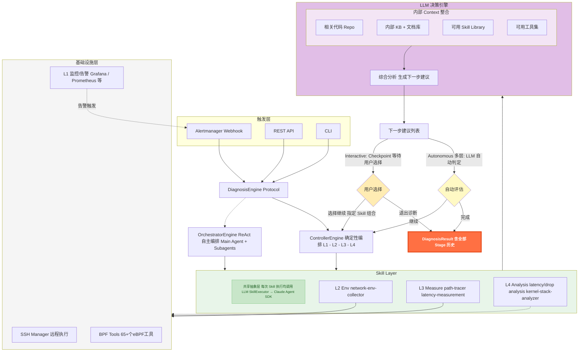

### 2.2 核心诊断数据流：Skill 输出后的模式分支

两个引擎都通过 Skill Layer 执行测量和分析，**关键差异在 Skill 输出之后的处理逻辑**：

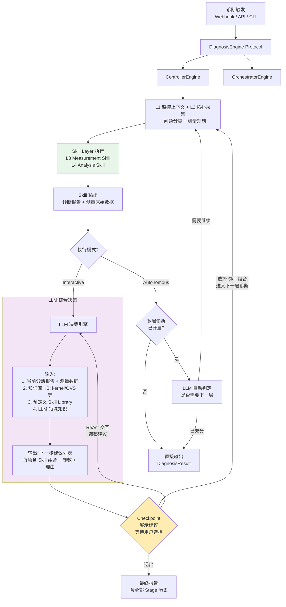

**数据流说明**：

1. **Skill Layer 执行后**，输出两类数据：诊断报告（结构化分析结果）和测量原始数据（日志文件、时间戳）
2. **Interactive 模式**：

   - Skill 输出 → **LLM 决策引擎**综合分析：诊断报告 + 测量数据 + 内部知识库（kernel/OVS 源码知识等）+ 预定义 Skill Library + LLM 自身领域知识
   - 输出结构化的**下一步建议列表**，每项包含推荐的 Skill 组合、参数配置、执行理由
   - 在 **Checkpoint** 处展示建议，用户可选择执行、通过 ReAct 交互调整方案、或退出
   - 选择执行后，回到 Controller 主逻辑，用选定的 Skill 组合进行下一轮 L3+L4
   - **整个循环可多层嵌套**：Stage 1 → Stage 2 → Stage 3 → ...
3. **Autonomous 模式**：

   - Skill 输出 → 直接返回 DiagnosisResult（默认行为）
   - 若开启**多层自动诊断选项**：LLM 自动判定是否需要下一层，无需人工确认，自动进入下一轮

### 2.3 双引擎对比

| 对比维度              | ControllerEngine                        | OrchestratorEngine                        |
| --------------------- | --------------------------------------- | ----------------------------------------- |
| **编排范式**    | LangGraph 风格（确定性图）              | ReAct Loop（自主 Agent）                  |
| **控制流**      | Python 硬编码序列 L1→L2→L3→L4        | LLM 动态决策下一步动作                    |
| **Skill 选择**  | WORKFLOW_TABLE 确定性查表               | LLM 自主决定调用哪个 Skill/工具           |
| **可预测性**    | 高（每次相同路径）                      | 低（LLM 可能跳过/重复步骤）               |
| **AI 调用次数** | 3-4 次（Skill 执行时调用 LLM）          | 5+ 次（Main Agent 决策 + Subagent Skill） |
| **Token 成本**  | 编排层零 LLM，Skill 执行时产生 LLM 消耗 | 编排层 + Skill 层均消耗 Token             |
| **适用场景**    | 固定工作流、单类型诊断                  | 复杂多类型、需动态策略调整                |
| **当前状态**    | ✅ 完整实现，316 tests                  | 🔧 框架 + 工具就绪，Subagent 编排待完善   |

**演进路径**：

| Phase             | 诊断类型数 | 推荐引擎              | 理由                             |
| ----------------- | ---------- | --------------------- | -------------------------------- |
| Phase 1（2-3 种） | 当前       | ControllerEngine      | 工作流固定，代码编排最可靠       |
| Phase 2（3-5 种） | 近期       | Controller + LLM 建议 | LLM 做跨工作流推荐，执行仍确定性 |
| Phase 3（5+ 种）  | 远期       | OrchestratorEngine    | 工作流组合爆炸，需 LLM 动态编排  |

从 Context×Action 闭环的角度理解这个演进：确定性编排 → ReAct 自主编排，本质上是 **Context 理解能力和 Action 决策能力的成熟度进阶**。在 Phase 1，我们用代码硬编码 Context→Action 的映射关系（WORKFLOW_TABLE）；Phase 2 引入 LLM 做建议但不做决策；Phase 3 才由 LLM 完全自主决策。每一步都建立在前一步积累的 Skill 和 Context 基础之上。

### 2.4 ControllerEngine 详解

ControllerEngine 是当前的生产引擎，316+ tests 覆盖。以下流程图展示了当前已实现的完整流程（实线）和 Phase 2 目标的多层递归扩展（虚线框）：

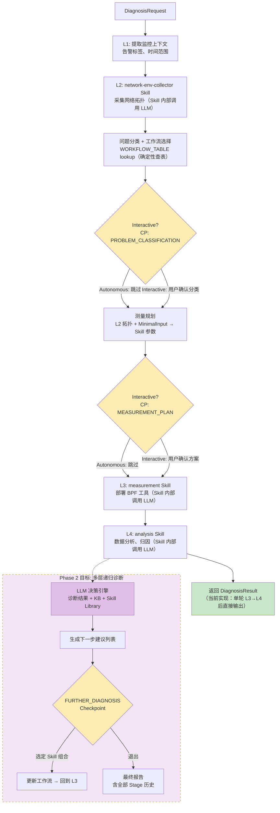

**关键说明**：

- **编排层零 LLM 消耗**：Controller 的控制流（L1→L2→Classify→Plan→L3→L4）完全由 Python 代码驱动。LLM 调用仅发生在 Skill 执行阶段（SkillExecutor → Claude Agent SDK）。
- **当前 2 个 Checkpoint**（黄色菱形）：`PROBLEM_CLASSIFICATION`（问题分类确认）和 `MEASUREMENT_PLAN`（测量方案确认），仅 Interactive 模式生效，Autonomous 模式自动跳过。
- **Phase 2 扩展**（虚线框）：L4 完成后进入 LLM 决策引擎，生成下一步建议，在 `FURTHER_DIAGNOSIS` Checkpoint 处等待用户选择。`FURTHER_DIAGNOSIS` 已在 `CheckpointType` enum 中定义但尚未接入流程。

#### LLM 决策引擎的输入与输出

**输入**：

- 当前 Stage 的诊断报告（结构化分析 + Markdown 报告）
- 测量原始数据（延迟分布、丢包事件、归因表）
- 知识库（KB）：kernel 网络栈、OVS 内部机制等领域知识, 代码 repo 等
- 预定义 Skill Library：所有已注册 Skill 的能力描述和适用场景
- LLM 自身的网络诊断领域知识

**输出**（结构化建议列表）：

```
分析摘要: "发送端主机内部延迟占比 85%, 未测量区域(虚拟化/VM内部)贡献显著"

建议选项:
  1. [执行分段测量] -> vm-latency-measurement Skill (segment mode, 8点位)
     理由: 当前 boundary 模式无法区分虚拟化各层, segment 模式可拆解 8 个阶段
  2. [常见问题排查] -> 提供 vhost 线程调度、OVS 慢路径等常见原因及排查方法
  3. [执行 drop 检测] -> system-network-path-tracer (packet_drop mode)
     理由: 高延迟可能伴随丢包, 建议同步检测
  4. [退出] -> 输出当前报告
```

### 2.5 OrchestratorEngine: ReAct 自主编排

OrchestratorEngine 采用 ReAct（Reasoning + Acting）范式，由 LLM 自主决策诊断流程。与 ControllerEngine 不同，**Orchestrator 不使用 WORKFLOW_TABLE**，而是由 LLM 根据上下文自主决定调用哪些工具和 Subagent：

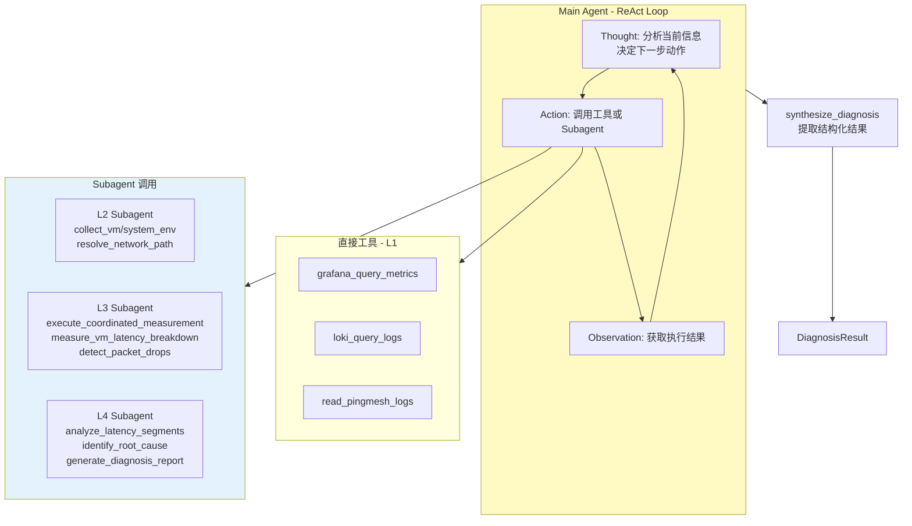

**Orchestrator 的诊断流程**：

1. **接收请求**：通过 `diagnose_alert()` 或 `diagnose_request()` 入口
2. **构建 Agent**：加载系统 Prompt（含完整工作流指导、工具描述、问题类型决策树），agent 内部使用的 skill 抽象基本可以复用非 react 编排场景的 skill
3. **ReAct 循环**（LLM 自主决策，不依赖 WORKFLOW_TABLE）：
   - LLM 分析告警/请求信息，自主决定先查询哪些监控数据（L1 工具）
   - 根据 L1 结果自主判断需要采集哪些环境信息（invoke L2 Subagent）
   - 自主规划测量方案并执行（invoke L3 Subagent）
   - 分析测量结果生成诊断报告（invoke L4 Subagent）
4. **结果合成**：从 Agent 输出中提取结构化 JSON，构建 `DiagnosisResult`

**当前状态**：

- ✅ Agent 框架和 ReAct 循环完整
- ✅ L1-L4 所有工具实现完整（17+ 工具通过 ToolExecutor 路由）
- ✅ 系统 Prompt 完善（含详细工作流指导和示例）
- ✅ 结果合成逻辑完整（JSON 解析 + 文本 fallback）
- 🔧 Subagent 结果解析待完善（`_parse_environment/measurement/diagnosis()` 需补充）

### 2.6 交互模式总览

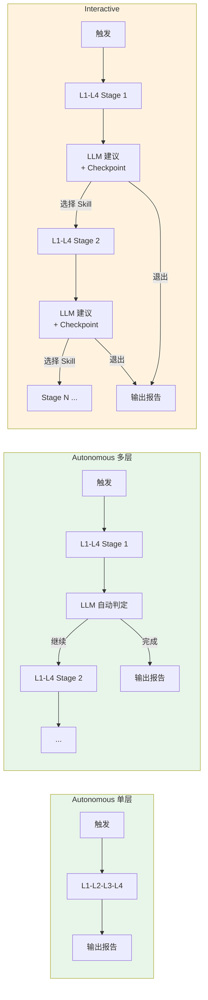

### 2.7 触发方式

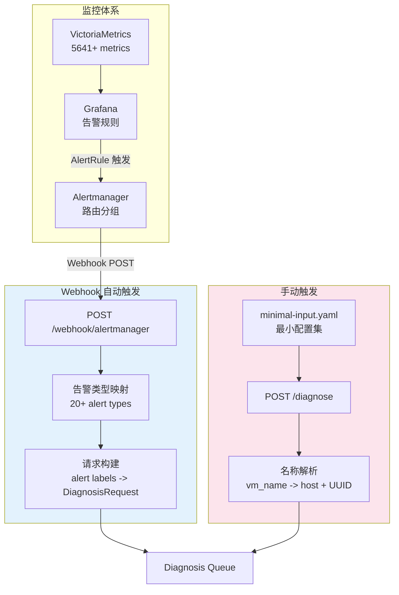

**Webhook 自动触发**：

- 与基础监控打通（Grafana → Alertmanager → Agent）
- 告警标签自动映射：`src_host`, `src_vm`, `dst_host`, `dst_vm`
- 支持 20+ 告警类型自动分类（VMNetworkLatency → latency, HostPacketLoss → packet_drop）
- 自动判断诊断模式（已知告警 → Autonomous，未知 → Interactive）

**手动触发**：

- 通过 REST API 提交诊断请求
- 输入仅需最小配置集（目标环境 IP + SSH 信息）
- 支持 VM 名称解析（通过 GlobalInventory 自动查找 host/UUID）

---

## 3. 核心数据流

### 3.1 告警驱动自动诊断流（Autonomous Mode）

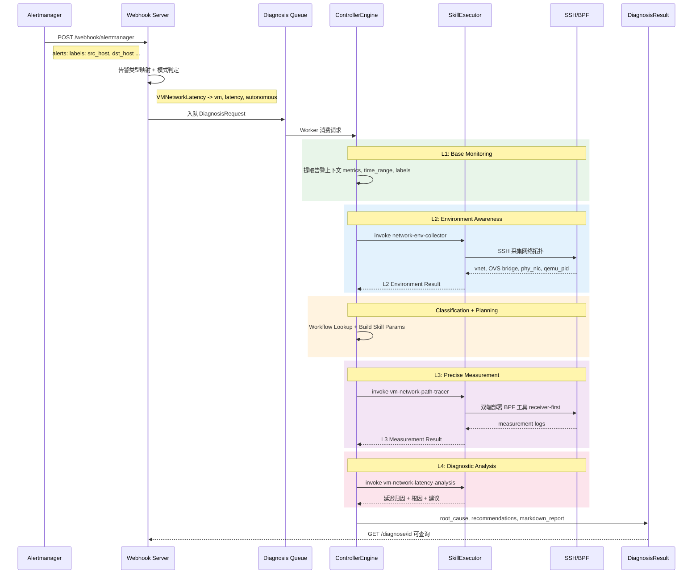

### 3.2 Interactive 诊断流：场景一 —— VM 延迟多层递归

从 boundary 定界到 segment 分段测量的完整 Interactive 流程：

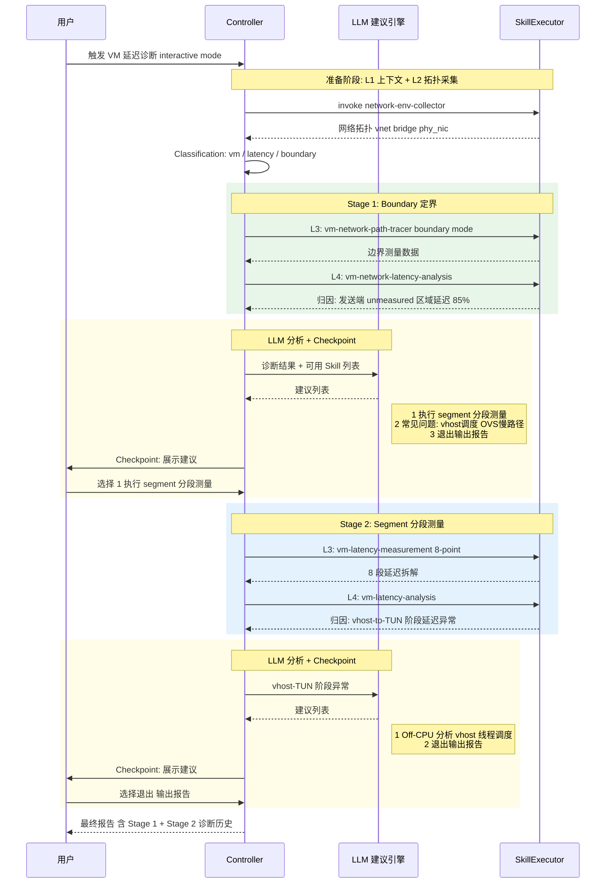

### 3.3 Interactive 诊断流：场景二 —— 系统网络丢包深入分析

从 boundary 丢包定界到详细 drop 测量工具的 Interactive 流程：

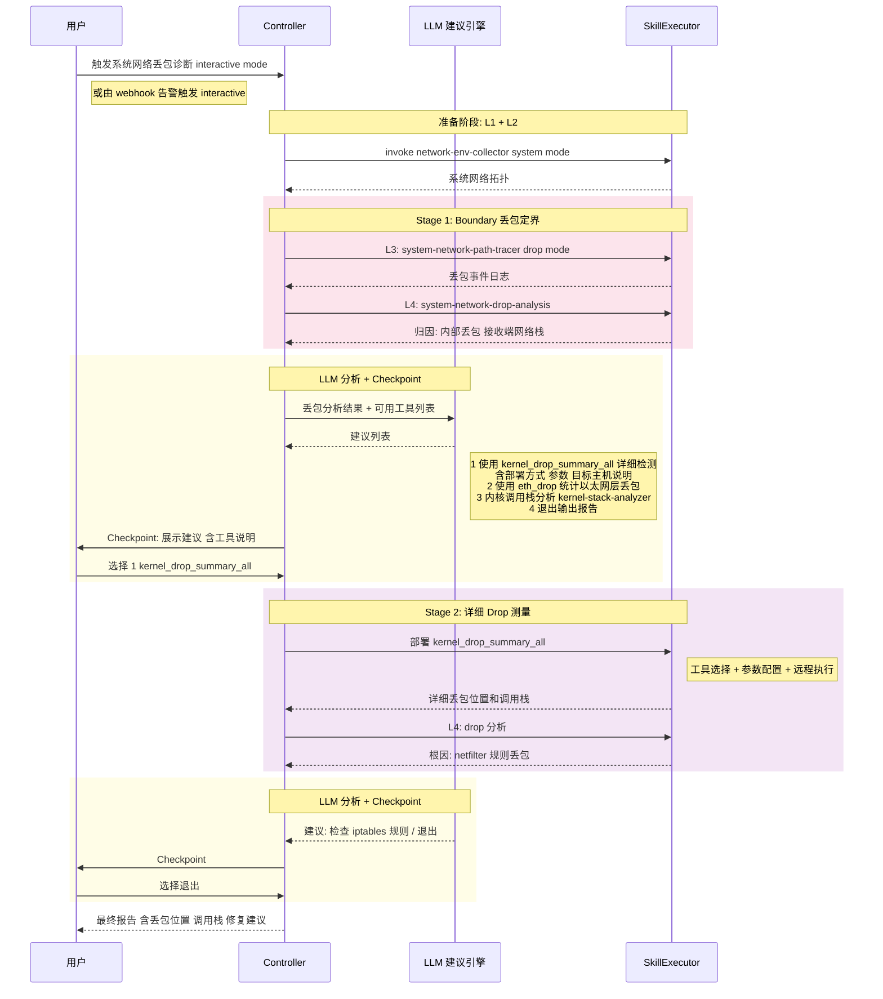

### 3.4 参数映射数据流（L2 → L3）

Skill 之间的数据流转是系统的关键设计：

```
L2 网络拓扑采集结果:                          L3 测量工具参数:
┌─────────────────────────────┐            ┌─────────────────────────────┐
│ src_env:                    │            │ sender_host_ssh: "root@..."  │
│   vm_uuid: "abc-123"       │   ═══►     │ sender_vm_ip: "10.0.0.1"    │
│   qemu_pid: 12345          │  自动映射   │ sender_vnet: "vnet0"        │
│   nics:                    │            │ sender_phy_nic: "eth0"       │
│     - host_vnet: "vnet0"   │            │ receiver_host_ssh: "root@..." │
│       ovs_bridge: "ovsbr"  │            │ receiver_vm_ip: "10.0.0.2"   │
│       physical_nics:       │            │ receiver_vnet: "vnet1"       │
│         - name: "eth0"     │            │ receiver_phy_nic: "eth0"     │
│                            │            │ duration: 30                 │
│ MinimalInputConfig:        │            │ protocol: "icmp"             │
│   test_ip: "10.0.0.1"     │            │ local_tools_path: "/path/..."│
│   ssh.host: "192.168.1.10"│            └─────────────────────────────┘
└─────────────────────────────┘
```

**设计要点**：

- `test_ip`（业务网络 IP）和 `ssh.host`（管理网络 IP）可以不同
- L2 采集的拓扑信息（vnet、bridge、phy_nic）自动映射为 L3 工具参数
- MinimalInputConfig 是 "唯一真相源"，所有诊断参数均从中派生

---

## 4. 关键设计考量

### 4.1 为什么选择 Skill 驱动架构

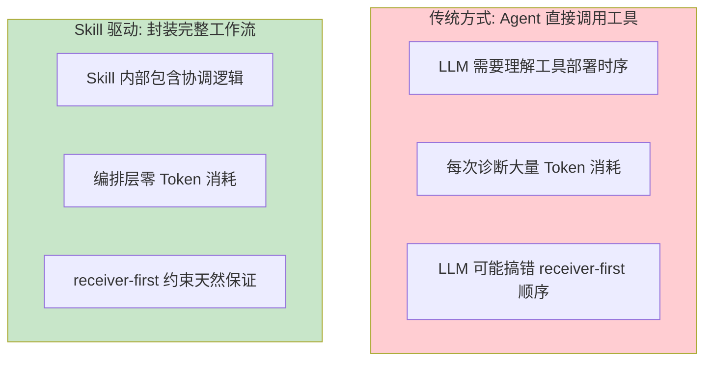

**核心原因**：

1. **复用已有 Skills**：network-env-collector、vm-latency-measurement 等已经过实战验证
2. **封装领域知识**：receiver-first 时序约束、8 点位部署逻辑都在 Skill 内部
3. **成本可控**：编排层（Controller）不调用 LLM，LLM 消耗集中在 Skill 执行阶段（SkillExecutor → Claude Agent SDK），路径确定性高

### 4.2 工作流注册表的可扩展性（ControllerEngine 专属）

```python
WORKFLOW_TABLE = {
    # (network_type, request_type, mode) → (measurement_skill, analysis_skill, param_builder)
    #
    # ========== Boundary Mode (边界定界) ==========
    ("system", "latency",     "boundary"): ("system-network-path-tracer", "system-network-latency-analysis", "_build_system_skill_params"),
    ("system", "packet_drop", "boundary"): ("system-network-path-tracer", "system-network-drop-analysis",    "_build_system_skill_params"),
    ("vm",     "latency",     "boundary"): ("vm-network-path-tracer",     "vm-network-latency-analysis",     "_build_vm_path_tracer_params"),
    ("vm",     "packet_drop", "boundary"): ("vm-network-path-tracer",     "vm-network-drop-analysis",        "_build_vm_path_tracer_params"),
    #
    # ========== Segment Mode (分段定界) ==========
    ("vm",     "latency",     "segment"):  ("vm-latency-measurement",     "vm-latency-analysis",             "_build_skill_params"),
}
```

**扩展方式**：新增诊断类型只需两步——注册 WORKFLOW_TABLE 条目 + 实现对应的 Skill 对（measurement + analysis）：

```python
# 未来扩展
("vm", "latency",     "event"):       ("kfree-skb-tracer",    "kernel-stack-analyzer",  "_build_event_params"),
("vm", "performance", "specialized"): ("ovs-flow-collector",  "ovs-flow-analysis",      "_build_ovs_params"),
```

### 4.3 Interactive Checkpoint 设计哲学

Interactive 模式的核心设计决策：**Checkpoint 只在 LLM 给出建议后设置**。

```
❌ 不这样做 (过多 Checkpoint, 打断流程):
   L1 → [CP] → L2 → [CP] → Classification → [CP] → L3 → [CP] → L4 → [CP]

✅ 这样做 (仅在决策点 Checkpoint):
   L1 → L2 → Classification → L3 → L4 → [LLM 分析] → [CP: 展示建议, 等待选择]
                                                              ↓ 选择继续
                                          L3' → L4' → [LLM 分析] → [CP]
```

**设计原则**：

- **Checkpoint = LLM 建议节点**：只有当 LLM 分析完结果并给出结构化建议时才暂停
- **建议包含上下文**：每个选项附带工具说明、参数配置、预期效果
- **支持 ReAct 交互**：用户可在 Checkpoint 处要求 LLM 调整建议（换方案、改参数）
- **退出随时可用**：每个 Checkpoint 都包含退出选项，输出当前已有的诊断报告
- **结果累积**：多层诊断的所有 Stage 结果自动累积到最终报告中

**当前实现状态**：`CheckpointManager` 通过 `asyncio.Event` 实现等待，API 端点（`GET/POST /diagnose/{id}/checkpoint`）支持前端交互。当前 Interactive 流程在 `PROBLEM_CLASSIFICATION`（问题分类确认）和 `MEASUREMENT_PLAN`（测量方案确认）两个 Checkpoint 处暂停。`CheckpointType.FURTHER_DIAGNOSIS` 已在 enum 中定义但尚未接入 `_run_interactive()` 流程——多层递归的 L3→L4 循环和建议生成逻辑是 Phase 2 的待实现项。

### 4.4 确定性编排 vs ReAct 自主的选择策略

ControllerEngine 和 OrchestratorEngine 不是竞争关系，而是渐进演进：

| Phase   | 诊断类型数 | 推荐引擎                     | 理由                             |
| ------- | ---------- | ---------------------------- | -------------------------------- |
| Phase 1 | 2-3 种     | Controller                   | 工作流固定，代码编排最可靠       |
| Phase 2 | 3-5 种     | Controller + LLM suggestions | LLM 做跨工作流推荐，执行仍确定性 |
| Phase 3 | 5+ 种      | Orchestrator                 | 工作流组合爆炸，需 LLM 动态编排  |

**Phase 1 → Phase 2 的关键桥梁**：Interactive 模式的 Controller + LLM 建议引擎本质上是一种 **"受控的 ReAct"**。Controller 保证每一轮 L3→L4 的执行是确定性的、可靠的，而 LLM 建议引擎负责在两轮之间做智能决策——推荐下一步应该用什么 Skill 组合、为什么。用户（或未来的自动评估）在 Checkpoint 处选择后，Controller 再次确定性地执行选定的工作流。

这种设计在确定性框架内引入了智能决策能力，同时保持了执行的可靠性和可调试性。它也是向 Phase 3 过渡的最佳跳板——当建议引擎的决策质量经过验证后，将 Checkpoint 的人工确认替换为 LLM 自动确认，就自然演进为 Orchestrator 的自主编排。

从 Context×Action 成熟度的角度理解这个演进：Phase 1 用代码硬编码 Context→Action 映射（WORKFLOW_TABLE 查表）；Phase 2 引入 LLM 理解 Context 并建议 Action，但最终执行仍由 Controller 把控；Phase 3 由 LLM 完全自主完成 Context 理解 → Action 决策 → 执行闭环。每一步都建立在前一步积累的 Skill、Context 结构和验证经验之上。

---

## 5. Skill 体系与工具映射

### 5.1 已实现 Skill 清单

| Skill                               | 层次 | 用途                 | 对应工具                    |
| ----------------------------------- | ---- | -------------------- | --------------------------- |
| `network-env-collector`           | L2   | 采集 VM/系统网络拓扑 | SSH + OVS/virsh 命令        |
| `vm-latency-measurement`          | L3   | 8 点位 VM 延迟测量   | icmp_path_tracer x 8        |
| `vm-network-path-tracer`          | L3   | VM 边界延迟/丢包检测 | icmp_path_tracer x 2        |
| `system-network-path-tracer`      | L3   | 主机间延迟/丢包检测  | system_icmp_path_tracer x 2 |
| `vm-latency-analysis`             | L4   | 8 段延迟归因分析     | 数据解析 + 统计计算         |
| `vm-network-latency-analysis`     | L4   | VM 边界延迟分析      | 日志解析 + 归因             |
| `vm-network-drop-analysis`        | L4   | VM 丢包事件分析      | 丢包日志解析 + 定位         |
| `system-network-latency-analysis` | L4   | 主机间延迟分析       | 日志解析 + 归因             |
| `system-network-drop-analysis`    | L4   | 主机间丢包分析       | 丢包日志解析 + 定位         |
| `kernel-stack-analyzer`           | L4   | 内核调用栈分析       | GDB/addr2line 解析          |

### 5.2 工具集到 Skill 的映射关系

```
troubleshooting-tools (65+ tools)         NetSherlock Skills (10)
┌──────────────────────────────┐         ┌──────────────────────┐
│ bcc-tools/                   │         │                      │
│  ├─ vm-network/              │         │                      │
│  │  ├─ icmp_path_tracer.py   │════════>│ vm-network-path-tracer│
│  │  ├─ tcp_path_tracer.py    │         │ vm-latency-measurement│
│  │  ├─ latency_summary.py    │         │                      │
│  │  └─ latency_details.py    │         │                      │
│  ├─ system-network/          │         │                      │
│  │  ├─ system_icmp_path_*.py │════════>│ system-network-path-  │
│  │  ├─ latency_summary.py    │         │   tracer              │
│  │  └─ latency_details.py    │         │                      │
│  ├─ drop/                    │         │                      │
│  │  ├─ eth_drop.py           │════════>│ kernel-stack-analyzer │
│  │  ├─ kernel_drop_summary_* │         │ (未来: drop-measurement│
│  │  └─ kernel_drop_details_* │         │  Skill)              │
│  └─ [per-layer tools x 27]  │         │ (Future Skills)      │
│                              │         │                      │
│ shell-scripts/               │         │                      │
│  └─ collect_network_env.sh   │════════>│ network-env-collector │
│                              │         │                      │
│ [分析脚本]                   │════════>│ *-analysis Skills     │
└──────────────────────────────┘         └──────────────────────┘
```

---

## 6. 已有实现与现状

### 6.1 实现进度

| 模块                 | 状态      | 说明                                                                                                                                                                                                          |
| -------------------- | --------- | ------------------------------------------------------------------------------------------------------------------------------------------------------------------------------------------------------------- |
| DiagnosisController  | ✅ 完整   | 确定性编排，5 种工作流，Autonomous + Interactive 双模式                                                                                                                                                       |
| SkillExecutor        | ✅ 完整   | Claude Agent SDK Skill 调用，支持超时和错误处理                                                                                                                                                               |
| Webhook Server       | ✅ 完整   | FastAPI，Alertmanager 集成，20+ 告警类型映射                                                                                                                                                                  |
| MinimalInputConfig   | ✅ 完整   | YAML 配置解析与 Pydantic 验证                                                                                                                                                                                 |
| GlobalInventory      | ✅ 完整   | 资产管理 + VM 名称解析（vm_name → host + UUID）                                                                                                                                                              |
| Checkpoint System    | ✅ 基础   | 2 种 Checkpoint 已激活（PROBLEM_CLASSIFICATION、MEASUREMENT_PLAN），FURTHER_DIAGNOSIS 已定义待接入，asyncio.Event 等待机制，API 交互                                                                          |
| LLM 建议引擎         | 📋 待实现 | 建议生成逻辑尚未实现，规划先实现规则驱动建议作为过渡，再向 LLM 驱动演进                                                                                                                                       |
| Schemas              | ✅ 完整   | 统一 Request/Result 数据模型，Pydantic v2                                                                                                                                                                     |
| 10 Claude Skills     | ✅ 完整   | L2/L3/L4 全链路覆盖（network-env-collector → *-analysis）                                                                                                                                                    |
| Orchestrator (ReAct) | 🔧 框架   | Agent 框架 + 17 工具就绪，Subagent 编排和结果合成待完善                                                                                                                                                       |
| Web 前端             | 🔧 基础   | React 19 + Tailwind CSS，基础页面框架和 mock 数据                                                                                                                                                             |
| L1 Context 诊断能力  | 📋 待建设 | 当前 L1 侧重从告警/监控输出直接触发 L2 Context 获取及后续深度诊断；仅靠 L1 Context（已有监控指标、日志、拓扑知识）完成常见问题初步排查的能力尚未建设，需梳理结构化领域知识、建立 L1 层 Skill 体系和诊断工作流 |

### 6.2 测试覆盖

**测试覆盖**：~40 个测试文件，316+ test cases（unit + integration），覆盖所有工作流路径、错误处理和边界条件。全量运行约 6 分钟。

### 6.3 已支持的诊断场景

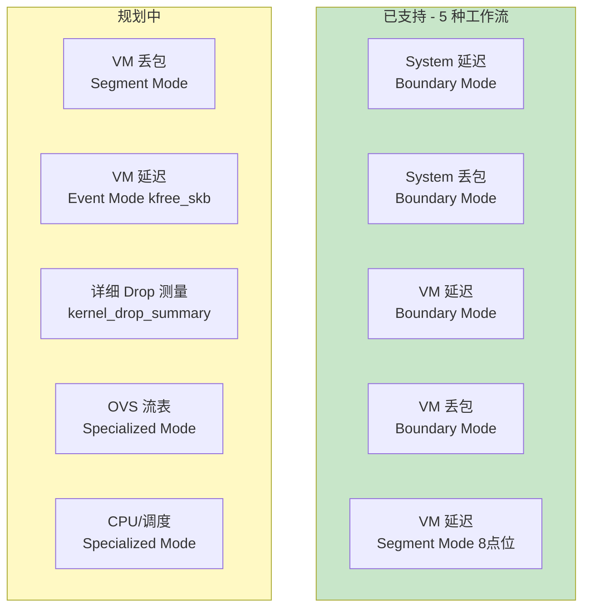

---

## 7. 演进路线

### 7.1 三阶段演进

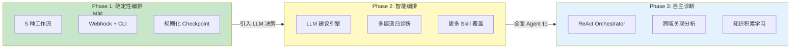

**Phase 1 → Phase 2 的关键变化**：

| 维度            | Phase 1 (当前)                   | Phase 2 (目标)                                 |
| --------------- | -------------------------------- | ---------------------------------------------- |
| Checkpoint 建议 | 规则驱动（仅 boundary→segment） | LLM 分析驱动（结合诊断结果 + Skill 列表）      |
| 诊断深度        | 单层诊断                         | 多层递归（boundary → segment → specialized） |
| 跨类型推荐      | 无                               | 延迟诊断后建议检查丢包，丢包后建议查调用栈     |
| Drop 工具支持   | boundary 定界                    | 详细 drop 工具选择与部署（新增 Skill）         |

### 7.2 从工具集到智能平台的完整进化

```
┌─────────────────────────────────────────────────────────────────────┐
│                      演进全景图                                      │
│                                                                     │
│  Stage 0          Stage 1           Stage 2           Stage 3      │
│  ────────         ────────          ────────          ────────      │
│                                                                     │
│  65+ eBPF 工具    10 Skills         智能编排           自主诊断     │
│  手动操作         自动执行           条件分支           ReAct Agent  │
│  专家经验         知识固化           LLM 辅助           自主决策     │
│  高认知负担       低使用门槛         人机协作           零干预       │
│                                                                     │
│  troubleshooting  NetSherlock       NetSherlock       NetSherlock  │
│  -tools           Phase 1           Phase 2           Phase 3      │
│                                                                     │
│  <────── 能力不变，交互革新 ──────>                                  │
│  <────── 工具层复用，控制层演进 ──────>                               │
└─────────────────────────────────────────────────────────────────────┘
```

---

## 8. 扩展指南

### 8.1 添加新工作流

这是最常见的扩展场景。以添加 "VM 延迟 event 模式" 为例：

**Step 1**：在 WORKFLOW_TABLE 注册新条目：

```python
# src/netsherlock/controller/diagnosis_controller.py
WORKFLOW_TABLE = {
    # ... 现有条目 ...
    ("vm", "latency", "event"): ("virtio-event-tracer", "vm-event-latency-analysis", "_build_vm_event_params"),
}
```

**Step 2**：实现 measurement Skill（`.claude/skills/virtio-event-tracer/SKILL.md`）：

- 定义 Skill 的输入参数格式（SSH 信息、test_ip、vnet 等）
- 编写 BPF 工具部署和执行逻辑（SSH → 传输工具 → 启动抓包 → 收集日志）
- 参考现有 `vm-network-path-tracer` 的 SKILL.md 作为模板

**Step 3**：实现 analysis Skill（`.claude/skills/vm-event-latency-analysis/SKILL.md`）：

- 定义分析输入格式（测量日志路径、环境信息）
- 编写数据解析和归因逻辑
- 参考现有 `vm-network-latency-analysis` 作为模板

**Step 4**：在 Controller 中添加参数构建方法：

```python
def _build_vm_event_params(self, state: DiagnosisState) -> dict:
    """从 L2 拓扑 + MinimalInputConfig 构建 event 模式参数"""
    # 参考 _build_vm_path_tracer_params() 的模式
    ...
```

**Step 5**：添加测试覆盖——至少包括工作流查表测试、参数构建测试和端到端 mock 测试。

### 8.2 添加新 Skill

Skill 是独立的执行单元，添加新 Skill 不影响现有代码：

- **Skill 位置**：`.claude/skills/<skill-name>/SKILL.md`
- **核心模式**：接收结构化参数 → SSH 远程执行工具 → 解析输出 → 返回结构化结果
- **参考模板**：`vm-network-path-tracer` 是最典型的 L3 Skill（双端部署、receiver-first、日志收集），`vm-network-latency-analysis` 是最典型的 L4 Skill（日志解析、统计计算、归因分析）
- **测试方式**：Skill 可在 Claude Code 中独立调用测试，不需要通过 Controller

### 8.3 引擎演进

**Phase 2（Controller + LLM 建议）**：

核心改动需要实现 `FURTHER_DIAGNOSIS` Checkpoint 的接入和建议生成逻辑。具体演进方向：

1. 将当前 Stage 的诊断结果（l3_measurements + l4_analysis）作为 prompt 输入
2. 将可用 Skill Library（所有已注册 Skill 的能力描述）作为 context
3. 调用 LLM 生成结构化建议（推荐 Skill 组合 + 理由 + 预期收益）
4. 保留 Controller 的确定性执行——用户选择建议后，Controller 按选定工作流确定性执行

**Phase 3（Orchestrator 自主编排）**：

主要待补完项：

- `_synthesize_diagnosis()`：从 Agent 的对话历史中提取结构化 `DiagnosisResult`，当前为 placeholder
- Subagent 结果解析：L2/L3/L4 Subagent 的输出需要解析为 `DiagnosisState` 的对应字段
- MinimalInputConfig 接入：当前 Orchestrator 未加载 MinimalInputConfig，需要在 Agent 初始化时注入

---

## 附录 A: 技术栈

| 组件            | 技术选型                                                |
| --------------- | ------------------------------------------------------- |
| Agent Framework | Claude Agent SDK                                        |
| 后端            | Python 3.11+, FastAPI, Pydantic                         |
| 前端            | React 19, TypeScript, Tailwind CSS, Vite                |
| 测量工具        | BCC/eBPF (Python), bpftrace                             |
| 监控集成        | Grafana, VictoriaMetrics, Loki, Alertmanager            |
| 远程执行        | SSH (asyncssh)                                          |
| 配置管理        | YAML (MinimalInputConfig), Env vars (Pydantic Settings) |
| 测试            | pytest, 316+ test cases                                 |

## 附录 B: 关键数据模型

### DiagnosisRequest

```python
DiagnosisRequest:
  request_id: str              # 唯一请求标识
  request_type: latency | packet_drop | connectivity
  network_type: vm | system
  src_host: str                # 源主机
  dst_host: str | None         # 目标主机
  src_vm: str | None           # 源虚拟机
  dst_vm: str | None           # 目标虚拟机
  source: CLI | WEBHOOK | API  # 触发来源
  mode: AUTONOMOUS | INTERACTIVE
  alert: AlertPayload | None   # 原始告警
  options: dict                # 扩展选项 (duration, segment, etc.)
```

### DiagnosisResult

```python
DiagnosisResult:
  diagnosis_id: str
  status: PENDING | RUNNING | WAITING | COMPLETED | ERROR
  started_at / completed_at: datetime

  # 诊断结论
  summary: str                 # 诊断摘要
  root_cause: RootCause        # 根因 (category, description, evidence)
  recommendations: [Recommendation]  # 修复建议 (priority, action, rationale)
  confidence: float            # 置信度 0-1

  # 各层数据
  l1_observations: dict        # 监控数据
  l2_environment: dict         # 网络拓扑
  l3_measurements: dict        # 测量结果
  l4_analysis: dict            # 分析详情

  # 报告产物
  markdown_report: str         # Markdown 格式报告
  report_path: str             # 报告文件路径
  checkpoint_history: list     # Interactive 模式: 各 Stage 决策记录
```
