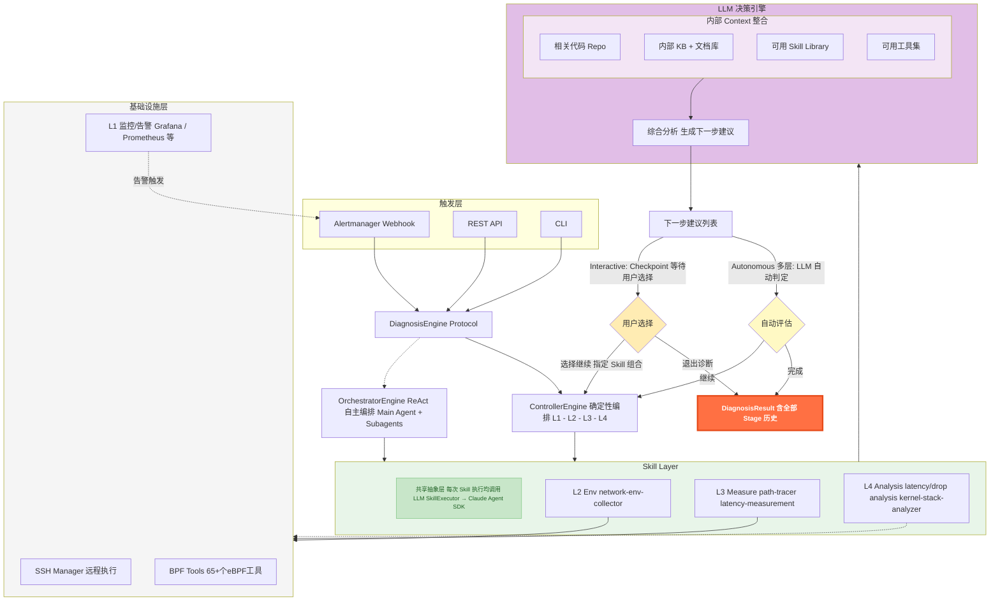
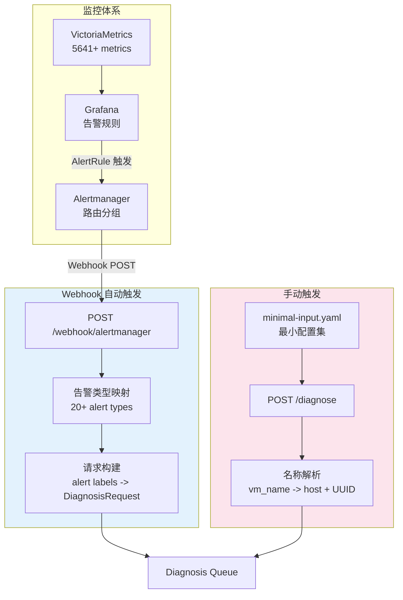
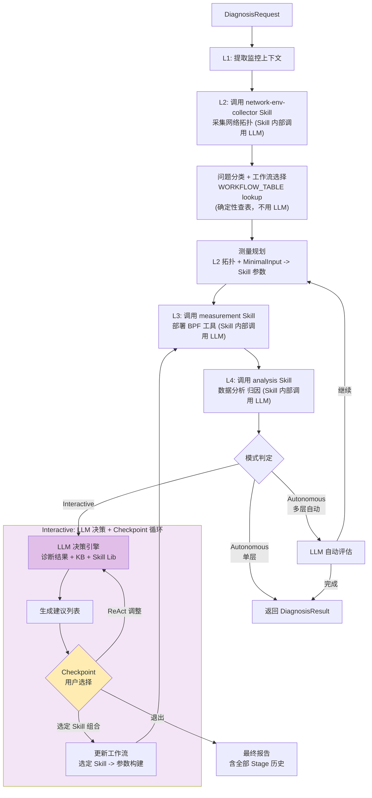
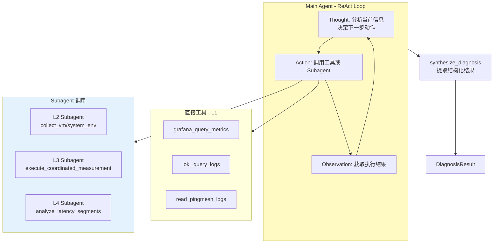
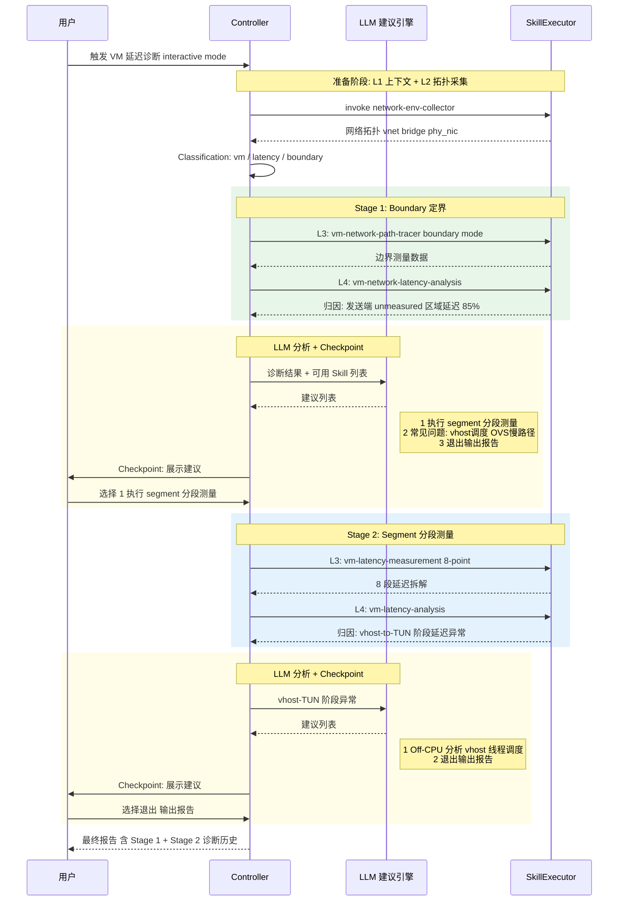
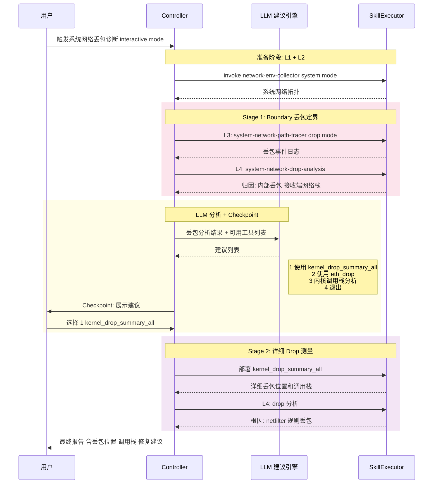

# NetSherlock 设计文档 v2

> 交接文档：从 65+ eBPF 工具到 AI 编排诊断平台的设计与实现

---

## 1. 设计概述

### 1.1 从工具集到智能平台

NetSherlock 项目的核心动机是解决一个实际矛盾：**我们已经拥有了 65+ 个覆盖全链路的 eBPF 网络测量工具（troubleshooting-tools），但工具能力越全面，使用复杂度越高**。一线运维人员需要同时掌握工具选择、参数配置、协调执行时序（如 receiver-first 约束）和多层结果解读——这些都是高度依赖专家经验的操作。

我们的目标是将分层诊断方法论编码为 AI Agent 的控制逻辑，实现 **"输入告警/配置 → 输出诊断报告"** 的端到端自动化，让工具能力保持不变的同时，彻底革新交互方式。

项目经历了从手动工具到智能平台的演进，以下是完整的进化全景：

```
Stage 0          Stage 1           Stage 2           Stage 3
────────         ────────          ────────          ────────
65+ eBPF 工具    10 Skills         智能编排           自主诊断
手动操作         自动执行           条件分支           ReAct Agent
专家经验         知识固化           LLM 辅助           自主决策
高认知负担       低使用门槛         人机协作           零干预

troubleshooting  NetSherlock       NetSherlock       NetSherlock
-tools           Phase 1           Phase 2           Phase 3

<────── 能力不变，交互革新 ──────>
<────── 工具层复用，控制层演进 ──────>
```

**当前状态**：Stage 1（Phase 1）已完成，Stage 2 的基础已具备。具体而言：

- **Stage 0 → Stage 1** 已完成：65+ 个底层工具被封装为 10 个可复用的 Skill，由 ControllerEngine 确定性编排，支持 5 种诊断工作流，覆盖 VM 和 System 网络的延迟/丢包场景。Webhook 集成 Alertmanager 实现告警自动触发。
- **Stage 1 → Stage 2** 基础就绪：Interactive 模式的 Checkpoint 机制和 LLM 建议引擎框架已实现（当前为规则驱动），OrchestratorEngine（ReAct）的 Agent 框架和工具层已就绪。后续接手可在此基础上引入 LLM 分析驱动的智能建议和多层递归诊断。

三个核心价值维度贯穿整个演进过程：
1. **降低使用门槛**：从 "需要理解 65+ 个工具" 到 "描述问题即可触发诊断"
2. **知识可复制**：专家的诊断经验编码在 Skill 定义和工作流编排中，团队共享
3. **闭环自动化**：监控告警 → 自动诊断 → 报告生成 → 推荐修复，完成可观测性闭环

### 1.2 设计原则

整个系统的设计遵循四个核心原则：

- **Skill 驱动**：将领域知识封装为可复用的诊断过程（Skill），而非让 AI 直接操作底层工具。每个 Skill 内部包含完整的协调逻辑（如 receiver-first 时序约束、8 点位 BPF 部署），编排层只需按名称调用 Skill 即可。选择这样设计是因为底层工具的操作复杂度不应暴露给编排引擎——无论是确定性 Controller 还是 ReAct Agent。

- **分层解耦**：L1-L4 各层通过明确的输入/输出契约连接，可独立演进。L2 拓扑采集的结果通过结构化映射转化为 L3 测量工具的参数，L3 的测量日志又作为 L4 分析的输入。层间依赖清晰、可测试。

- **渐进智能化**：确定性编排 → LLM 辅助 → 自主 Agent，按需演进而非一步到位。我们在 Phase 1 选择了 ControllerEngine（确定性编排）作为生产引擎，同时保留了 OrchestratorEngine（ReAct）的框架。这不是技术债，而是有意为之——在诊断类型有限（2-3 种）时，确定性编排的可靠性和可调试性远优于 LLM 自主决策。

- **Context 结构化**：Skill 的本质是将领域知识以结构化方式组织为模型可用的 context。L1-L2 层收集和组织环境信息（Layer 1 Context），L3 层通过主动测量获取深层数据（Layer 2 Context，通过 Action 获得），L4 层则在这些结构化 context 的基础上进行智能分析。这种视角贯穿整个架构设计——每增加一层 Skill，本质上是在为 LLM 提供更丰富、更结构化的诊断 context。

---

## 2. 系统架构

### 2.1 整体分层架构

系统采用五层架构：触发层、引擎层、Skill 层、LLM 决策引擎、基础设施层。以下是完整的架构图：



**各层职责说明**：

- **触发层**：三种入口统一为 `DiagnosisRequest`。Alertmanager Webhook 支持 20+ 告警类型自动映射，REST API 接受手动诊断请求，CLI 支持本地调试。所有入口通过 `DiagnosisEngine Protocol` 解耦，不依赖具体引擎实现。

- **引擎层**：两个引擎共享同一个 `DiagnosisEngine` 协议接口。ControllerEngine（确定性编排）是当前生产可用的引擎；OrchestratorEngine（ReAct 自主编排）是为未来准备的智能引擎。Webhook 层（`src/netsherlock/api/webhook.py`）通过协议接口与引擎交互，切换引擎无需修改 API 层代码。

- **Skill Layer**：共享抽象层，两个引擎共用同一套 Skill。每次 Skill 执行通过 `SkillExecutor` 调用 Claude Agent SDK，由 LLM 驱动实际的工具操作。Skill 内部封装了完整的领域知识——工具选择、参数构建、部署时序、结果解析。

- **LLM 决策引擎**：在 Interactive 模式下，L4 分析完成后由 LLM 综合诊断结果、知识库（KB）、Skill Library 和领域知识，生成结构化的下一步建议列表。在 Autonomous 模式下可由 LLM 自动判定是否需要下一层诊断。

- **基础设施层**：SSH Manager 管理远程执行连接池，BPF Tools 是 troubleshooting-tools 仓库中的 65+ 个 eBPF 工具，L1 监控通过 Grafana/VictoriaMetrics/Loki 提供基线数据和告警触发。

### 2.2 四层诊断模型

四层诊断模型源自 troubleshooting-tools 在实践中形成的分层诊断方法论。我们将其映射为 Agent 的 L1-L4 执行层：

| Layer | Tools / Skills | Purpose | Status |
|-------|---------------|---------|--------|
| L1 | `grafana_query_metrics`, `loki_query_logs`, `read_pingmesh_logs` | Base monitoring data：告警上下文、监控指标、历史日志 | ✅ |
| L2 | `collect_vm_network_env`, `collect_system_network_env` | Environment topology：网络拓扑采集（vnet、OVS bridge、物理网卡、QEMU PID） | ✅ |
| L3 | `execute_coordinated_measurement`, `measure_vm_latency_breakdown` | BPF measurement：eBPF 工具部署与协调执行（双端部署、receiver-first 时序） | ✅ |
| L4 | `analyze_latency_segments`, `generate_diagnosis_report` | Analysis & reporting：延迟归因、丢包定位、根因分析、修复建议 | ✅ |

从 Context 的视角来理解这四层的本质：

- **L1-L2 = Layer 1 Context 组织**：将环境信息（告警数据、网络拓扑、设备状态）收集并结构化，为后续测量提供参数依据。这些信息是"已有的"，只需收集和组织。
- **L3 = Layer 2 Context，通过 Action 获取**：某些诊断所需的信息无法从现有监控中获得，必须通过主动测量（部署 eBPF 工具）来获取。L3 的测量结果（延迟分布、丢包事件、调用栈）是只有通过 Action 才能得到的深层 Context。
- **L4 = Intelligence 分析闭环**：在充分的 Context（L1+L2 环境 + L3 测量）基础上，由 LLM 进行综合分析、归因计算和建议生成。这是 Context → Intelligence 的转化环节。

每一轮 L3→L4 的执行，本质上就是一次 **Context → Intelligence → Action** 的迭代。Interactive 模式下的多层诊断，就是多次这样的迭代。

### 2.3 触发与入口

系统支持两种触发方式：Webhook 自动触发和 REST API 手动触发。



**Webhook 自动触发**（已实现）：
- 与基础监控打通：Grafana 告警规则 → Alertmanager 路由 → Agent Webhook
- 告警标签自动映射：`src_host`, `src_vm`, `dst_host`, `dst_vm` 等 label 直接映射为 `DiagnosisRequest` 字段
- 支持 20+ 告警类型自动分类（如 `VMNetworkLatency` → `vm/latency`，`HostPacketLoss` → `system/packet_drop`）
- 自动判断诊断模式：已知告警类型走 Autonomous，未知类型走 Interactive
- 诊断结果持久化为 JSON 文件，通过 `GET /diagnose/{id}` 可查询

**手动触发**（已实现）：
- 通过 REST API（`POST /diagnose`）提交诊断请求
- 输入仅需最小配置集（`minimal-input.yaml`），包含目标环境的 IP 和 SSH 信息
- 支持 VM 名称解析：通过 `GlobalInventory` 自动查找 VM 所在的 host 和 UUID
- MinimalInputConfig 是参数的 "唯一真相源"，所有诊断参数均从中派生

---

## 3. 核心设计

### 3.1 Skill 体系与工具映射

Skill 是 NetSherlock 的核心抽象。每个 Skill 封装了一个完整的诊断过程——工具选择、参数构建、远程部署、协调执行、结果收集。编排引擎通过 `SkillExecutor` 按名称调用 Skill，无需了解内部实现细节。

**已实现 Skill 清单**：

| Skill | Layer | Purpose | Corresponding Tools |
|-------|-------|---------|-------------------|
| `network-env-collector` | L2 | VM/系统网络拓扑采集 | SSH + OVS/virsh 命令 |
| `vm-latency-measurement` | L3 | 8 点位 VM 全路径延迟测量 | icmp_path_tracer x 8 |
| `vm-network-path-tracer` | L3 | VM 边界延迟/丢包检测 | icmp_path_tracer x 2 |
| `system-network-path-tracer` | L3 | 主机间延迟/丢包检测 | system_icmp_path_tracer x 2 |
| `vm-latency-analysis` | L4 | 8 段延迟归因分析 | 数据解析 + 统计计算 |
| `vm-network-latency-analysis` | L4 | VM 边界延迟分析 | 日志解析 + 归因 |
| `vm-network-drop-analysis` | L4 | VM 丢包事件分析 | 丢包日志解析 + 定位 |
| `system-network-latency-analysis` | L4 | 主机间延迟分析 | 日志解析 + 归因 |
| `system-network-drop-analysis` | L4 | 主机间丢包分析 | 丢包日志解析 + 定位 |
| `kernel-stack-analyzer` | L4 | 内核调用栈分析 | GDB/addr2line 解析 |

**工具集到 Skill 的映射关系**：

```
troubleshooting-tools (65+ tools)         NetSherlock Skills (10)
┌──────────────────────────────┐         ┌──────────────────────┐
│ bcc-tools/                   │         │                      │
│  ├─ vm-network/              │         │                      │
│  │  ├─ icmp_path_tracer.py   │════════>│ vm-network-path-tracer│
│  │  ├─ tcp_path_tracer.py    │         │ vm-latency-measurement│
│  │  └─ ...                   │         │                      │
│  ├─ system-network/          │         │                      │
│  │  ├─ system_icmp_path_*.py │════════>│ system-network-path-  │
│  │  └─ ...                   │         │   tracer              │
│  ├─ drop/                    │         │                      │
│  │  ├─ eth_drop.py           │════════>│ kernel-stack-analyzer │
│  │  └─ kernel_drop_*         │         │                      │
│  └─ [per-layer tools × 27]  │         │ (Future Skills)      │
│                              │         │                      │
│ shell-scripts/               │         │                      │
│  └─ collect_network_env.sh   │════════>│ network-env-collector │
│                              │         │                      │
│ [分析脚本]                   │════════>│ *-analysis Skills     │
└──────────────────────────────┘         └──────────────────────┘
```

从 Context 的视角来看这个映射：测量工具 → Skills 的封装过程，本质上是将 Layer 2 Context（需要通过主动测量/追踪才能获得的深层诊断数据）组织为模型可用的结构化格式。65+ 个工具的原始输出（日志文件、时间戳序列、调用栈）经过 Skill 封装后，变为 LLM 能够理解和分析的结构化数据。

**SkillExecutor 的工作方式**：每次 Skill 调用通过 Claude Agent SDK 创建一个子 Agent，该 Agent 读取对应的 `SKILL.md` 文件（`.claude/skills/{skill-name}/SKILL.md`）获取执行指令，然后使用 Bash 工具执行实际的 SSH/BPF 操作。这种设计使得 Skill 的修改只需更新 SKILL.md 文件，无需改动 Python 代码。

### 3.2 工作流注册表

工作流注册表（WORKFLOW_TABLE）是 ControllerEngine 的核心调度机制。它将三个分类维度映射到具体的 Skill 组合：

**分类维度**：

- **NetworkType**：`system`（主机间网络）| `vm`（虚机间网络）
- **ProblemType**：`latency`（延迟异常）| `packet_drop`（丢包异常）| `connectivity`（连通性，未来）| `performance`（性能，未来）
- **DiagnosisMode**：`boundary` | `segment` | `event` | `specialized`

**模式说明**：

| Mode | Scope | Use Case | Dependency |
|------|-------|----------|------------|
| boundary | 边界点 (vnet↔phy) | 快速定界：内部 vs 外部 | 最小（仅需 host SSH） |
| segment | 全链路所有主要模块 | 精确定位：全分段延迟分解 | 中等（需 VM SSH） |
| event | 所有数据包事件 | 详细追踪：丢包事件、延迟异常 | 较高（需 root） |
| specialized | 特定模块/协议 | 深入分析：OVS datapath、TCP 重传 | 视情况而定 |

选择这四种模式是因为它们对应了实际排查中的自然递进关系：先定界（boundary）确定问题范围，再分段（segment）精确定位，然后追踪事件（event）找到具体丢包/异常，最后做专项分析（specialized）。这也是 Interactive 多层诊断的 escalation 路径。

**完整工作流矩阵**（已实现 + 规划中）：

| Network | Problem | Boundary | Segment | Event | Specialized |
|---------|---------|----------|---------|-------|-------------|
| system | latency | ✅ system-network-path-tracer | 📋 system-segment-tracer | 📋 packet-event-tracer | 📋 irq-latency-tracer |
| system | packet_drop | ✅ system-network-path-tracer | 📋 system-segment-tracer | 🔧 kfree-skb-tracer | 📋 tcp-retrans-tracer |
| vm | latency | ✅ vm-network-path-tracer | ✅ vm-latency-measurement | 📋 virtio-event-tracer | 📋 ovs-flow-collector |
| vm | packet_drop | ✅ vm-network-path-tracer | 📋 vm-drop-measurement | 🔧 kfree-skb-tracer | — |

状态标记：✅ 已实现, 🔧 部分实现, 📋 规划中

**WORKFLOW_TABLE 代码实现**：

```python
WORKFLOW_TABLE = {
    # (network_type, request_type, mode) → (measurement_skill, analysis_skill, param_builder)
    #
    # ========== Boundary Mode (边界定界) ==========
    ("system", "latency",     "boundary"): ("system-network-path-tracer", "system-network-latency-analysis", "_build_system_skill_params"),
    ("system", "packet_drop", "boundary"): ("system-network-path-tracer", "system-network-drop-analysis",    "_build_system_skill_params"),
    ("vm",     "latency",     "boundary"): ("vm-network-path-tracer",     "vm-network-latency-analysis",     "_build_vm_path_tracer_params"),
    ("vm",     "packet_drop", "boundary"): ("vm-network-path-tracer",     "vm-network-drop-analysis",        "_build_vm_path_tracer_params"),
    #
    # ========== Segment Mode (分段定界) ==========
    ("vm",     "latency",     "segment"):  ("vm-latency-measurement",     "vm-latency-analysis",             "_build_skill_params"),
}
```

**扩展模式**：新增诊断类型只需两步——注册 WORKFLOW_TABLE 条目 + 实现对应的 Skill 对（measurement + analysis）。例如：

```python
# 未来扩展
("vm", "latency",     "event"):       ("kfree-skb-tracer",    "kernel-stack-analyzer",  "_build_event_params"),
("vm", "performance", "specialized"): ("ovs-flow-collector",  "ovs-flow-analysis",      "_build_ovs_params"),
```

这是一个有意的简单设计：在诊断类型有限的阶段，一个 dict 查表比复杂的 WorkflowRegistry 类层次更直观、更易维护。当工作流数量增长到需要依赖检查、优先级排序和降级策略时，可以演进为 `diagnosis-workflow-architecture.md` 中设计的 `WorkflowRegistry` + `WorkflowSelector` 架构。

### 3.3 双引擎设计

系统实现了两个引擎，共享同一个 `DiagnosisEngine` 协议接口，但采用完全不同的编排范式。

#### ControllerEngine：确定性编排

ControllerEngine 是当前的生产引擎，316+ tests 覆盖。其内部流程：



**关键实现细节**：

- **编排层零 LLM 消耗**：Controller 的控制流（L1→L2→Classification→Plan→L3→L4）完全由 Python 代码驱动，不消耗 token。LLM 调用仅发生在 Skill 执行阶段（`SkillExecutor` → Claude Agent SDK）。
- **WORKFLOW_TABLE 查表**：问题分类和工作流选择通过 `_lookup_workflow()` 函数实现，是纯 Python 的 dict 查找，不涉及 LLM。
- **参数映射**：L2 拓扑采集的结果（vnet、OVS bridge、物理网卡）通过 `_build_*_params()` 方法自动映射为 L3 测量工具的参数，结合 `MinimalInputConfig` 中的 SSH 信息和 test IP。
- **每次 execute() 创建新的 DiagnosisController**：`ControllerEngine` 本身无状态，所有诊断状态（`DiagnosisState`）在 Controller 实例中管理。

这是当前生产可用的引擎，44 个测试文件、316+ test cases 覆盖了所有工作流路径、错误处理和边界条件。

#### OrchestratorEngine：ReAct 自主编排

OrchestratorEngine 采用 ReAct（Reasoning + Acting）范式，由 LLM 自主决策诊断流程：



**当前状态**：框架就绪，编排逻辑待完善。具体而言：
- ✅ Agent 框架和 ReAct 循环完整（`agents/orchestrator.py`）
- ✅ L1-L4 所有工具实现完整（17+ 工具通过 `ToolExecutor` 路由）
- ✅ 系统 Prompt 完善（含详细工作流指导和示例）
- 🔧 `_synthesize_diagnosis()` 为 placeholder，结果提取不完整
- 🔧 Subagent 结果解析待完善
- 🔧 无 MinimalInputConfig 加载逻辑
- 🔧 Alert → node config 映射缺失

后续接手如需启用 OrchestratorEngine，主要工作集中在结果合成和配置加载，Agent 框架本身已可运行。

#### 双引擎对比

| Dimension | ControllerEngine | OrchestratorEngine |
|-----------|-----------------|-------------------|
| 编排范式 | LangGraph-style 确定性图 | ReAct Loop 自主 Agent |
| 控制流 | Python 硬编码 L1→L2→L3→L4 | LLM 动态决策下一步 |
| Skill 选择 | WORKFLOW_TABLE 查表 | LLM 自主选择 |
| 可预测性 | 高（每次相同路径） | 低（LLM 可能跳过/重复步骤） |
| LLM 调用次数 | 3-4 次（仅 Skill 执行内部） | 5+ 次（编排层 + Skill 层均消耗） |
| Token 成本 | 编排层零消耗 | 编排层 + Skill 层双重消耗 |
| 当前状态 | ✅ Production-ready, 316+ tests | 🔧 框架就绪，编排待完善 |

**演进路径**：

| Phase | 诊断类型数 | 推荐引擎 | 理由 |
|-------|-----------|---------|------|
| Phase 1（2-3 种） | 当前 | ControllerEngine | 工作流固定，代码编排最可靠 |
| Phase 2（3-5 种） | 近期 | Controller + LLM 建议 | LLM 做跨工作流推荐，执行仍确定性 |
| Phase 3（5+ 种） | 远期 | OrchestratorEngine | 工作流组合爆炸，需 LLM 动态编排 |

从 Context×Action 闭环的角度理解这个演进：确定性编排 → ReAct 自主编排，本质上是 **Context 理解能力和 Action 决策能力的成熟度进阶**。在 Phase 1，我们用代码硬编码 Context→Action 的映射关系（WORKFLOW_TABLE）；Phase 2 引入 LLM 做建议但不做决策；Phase 3 才由 LLM 完全自主决策。每一步都建立在前一步积累的 Skill 和 Context 基础之上。

### 3.4 Interactive 多层诊断

Interactive 模式是 Phase 2 的核心能力，实现了人机协作的多层递归诊断。

#### Checkpoint 设计哲学

我们做了一个关键的设计决策：**Checkpoint 只在 LLM 给出建议后设置**，而不是在每个阶段之间都设置。

```
❌ 过多 Checkpoint:
   L1 → [CP] → L2 → [CP] → L3 → [CP] → L4 → [CP]

✅ 仅在决策点:
   L1 → L2 → L3 → L4 → [LLM 分析] → [CP: 展示建议]
                                              ↓ 选择继续
                          L3' → L4' → [LLM 分析] → [CP]
```

选择这样设计的原因：L1→L2→L3→L4 是一个完整的诊断过程，中间打断没有决策价值（用户无法在 L2 拓扑采集后做出有意义的决策）。真正需要人参与决策的时刻是 L4 分析出结果之后——此时 LLM 根据诊断结果和可用 Skill 列表给出结构化建议，用户在此做出判断。

**实现机制**：`CheckpointManager` 通过 `asyncio.Event` 实现等待，API 端点（`GET/POST /diagnose/{id}/checkpoint`）支持前端交互，CLI 模式通过回调函数直接与用户交互。

#### LLM 建议引擎

建议引擎的输入和输出设计：

**输入**：
- 当前 Stage 的诊断报告（结构化分析 + Markdown 报告）
- 测量原始数据（延迟分布、丢包事件、归因表）
- 知识库（KB）：kernel 网络栈、OVS 内部机制等领域知识
- 预定义 Skill Library：所有已注册 Skill 的能力描述和适用场景
- LLM 自身的网络诊断领域知识

**输出**（结构化建议列表）：每个选项包含推荐的 Skill 组合、参数配置和执行理由。

**当前状态**：建议生成是规则驱动的（`_generate_stage_suggestions()` 基于 WORKFLOW_TABLE 的 escalation 路径生成建议）。目标状态是由 LLM 综合分析后生成建议——这是后续接手的关键演进方向。

#### 场景 1: VM 延迟多层诊断

从 boundary 定界到 segment 分段测量的完整 Interactive 流程：



这个场景展示了 Interactive 模式的核心价值：Stage 1 的 boundary 定界发现 "发送端 unmeasured 区域延迟占比 85%"，但无法确定是 vhost 调度、TUN 处理还是 OVS 导致。用户选择 segment 分段测量后，Stage 2 将问题精确到 "vhost-to-TUN 阶段"。两个 Stage 的结果累积在最终报告中。

#### 场景 2: 系统网络丢包深入分析

从 boundary 丢包定界到详细 drop 测量工具的 Interactive 流程：



这个场景展示了从粗粒度定界到精确根因定位的过程：Stage 1 确定 "接收端网络栈内部丢包"，Stage 2 通过 `kernel_drop_summary_all` 工具获取具体的内核调用栈，最终定位到 netfilter 规则导致的丢包。

**贯穿两个场景的核心模式**：每一轮 L3→L4 的执行就是一次 Context→Intelligence→Action 的迭代。Stage 1 获取粗粒度 Context，Stage 2 获取细粒度 Context，每次迭代都在前一轮的基础上缩小问题范围、提高诊断精度。

---

## 4. 关键设计决策

### 4.1 为什么 Skill 驱动

选择 Skill 驱动架构而非让 LLM 直接操作底层工具，基于三个核心理由：

**1. 复用已有 Skills**：`network-env-collector`、`vm-latency-measurement`、`vm-network-path-tracer` 等 10 个 Skill 在 Claude Code 环境中已经过实战验证——它们从 troubleshooting-tools 的 65+ 个底层工具中提炼而来，经历了数十次真实诊断场景的打磨。重新让 LLM 学习操作这些底层工具，等于丢弃了已有的实践积累。

**2. 封装领域知识**：网络测量存在大量隐式约束，最典型的是 receiver-first 时序——BPF 抓包工具必须先在接收端部署并就绪，然后发送端才能开始发包，否则前几秒的数据会丢失。类似的还有 8 点位 BPF 部署逻辑（VM 内核 → vnet → OVS → 物理网卡，双端各 4 个点位）。这些领域知识封装在 Skill 内部，编排层（无论是 Controller 还是 Orchestrator）无需理解这些细节，只需按名称调用 Skill。

**3. 成本可控**：编排层（Controller）不调用 LLM，LLM 消耗集中在 Skill 执行阶段（`SkillExecutor` → Claude Agent SDK）。一次完整诊断仅需 3-4 次 LLM 调用（L2 拓扑采集、L3 测量执行、L4 分析归因），编排层的控制流、参数映射、工作流查表全部是零 token 消耗的 Python 代码。

**与替代方案的对比**：如果让 LLM 直接操作底层工具（类似纯 ReAct 模式），会面临三个问题：
- LLM 需理解工具部署时序 → 可能搞错 receiver-first 顺序，导致测量数据无效
- 每次诊断的大量 token 消耗在工具协调上（SSH 连接管理、文件传输、进程等待），而非真正的智能分析
- 工具参数组合复杂（host SSH、test IP、vnet 名称、OVS bridge、物理网卡……），LLM 容易出错

从 Context 结构化的视角来看，Skill 的本质是将领域知识以结构化方式组织为模型可用的 context。底层工具的原始输出（日志文件、时间戳序列、内核调用栈）经过 Skill 封装后，变为 LLM 能够理解和分析的结构化诊断数据。Skill 不仅是执行单元，更是 Context 组织单元。

### 4.2 为什么 MVP 选确定性编排

在 Phase 1 选择 ControllerEngine（确定性编排）而非 OrchestratorEngine（ReAct）作为生产引擎，是基于网络诊断场景的四个特性：

**1. 流程确定性要求高**：L3 测量阶段涉及远程节点 BPF 工具部署和多点协调——先 SSH 到接收端部署 `icmp_path_tracer`、等待就绪信号、再 SSH 到发送端启动发包、等待测量完成、收集两端日志。任何步骤的顺序错误都会导致无效数据。确定性编排用 Python 代码硬编码这个流程，每次执行路径完全一致。

**2. 成本敏感**：ReAct 循环的主 Agent 在每一轮 Thought/Action/Observation 中都消耗 token，而实际上大部分"决策"在网络诊断中是固定的——确定了问题类型（vm/latency）和模式（boundary），执行流程就完全确定了。将编排层的 token 消耗降为零，意味着同样的预算可以支持更多次诊断。

**3. 可调试性**：生产环境中诊断失败时，需要精确定位是哪个阶段出了问题。ControllerEngine 的线性流程（L1→L2→classify→plan→L3→L4）使得每个阶段的输入输出都可追溯，日志清晰标记了 `phase: L2_ENV_COLLECTION`、`phase: L3_MEASUREMENT` 等。ReAct 循环的执行路径不可预测，同一个输入可能走不同的路径，调试时需要还原 LLM 的推理过程。

**4. 当前诊断类型单一**：Phase 1 仅覆盖 2-3 种诊断类型（vm/system 的 latency/packet_drop），线性 L1→L2→L3→L4 工作流足以覆盖所有场景。引入 ReAct 的动态决策能力在此阶段属于过度设计——增加了复杂度却没有带来收益。

### 4.3 确定性 vs ReAct 的选择策略

ControllerEngine 和 OrchestratorEngine 不是竞争关系，而是渐进演进：

| Phase | 诊断类型数 | 推荐引擎 | 理由 |
|-------|-----------|---------|------|
| Phase 1 | 2-3 种 | Controller | 工作流固定，代码编排最可靠 |
| Phase 2 | 3-5 种 | Controller + LLM suggestions | LLM 做跨工作流推荐，执行仍确定性 |
| Phase 3 | 5+ 种 | Orchestrator | 工作流组合爆炸，需 LLM 动态编排 |

**Phase 1 → Phase 2 的关键桥梁**：Interactive 模式的 Controller + LLM 建议引擎本质上是一种 **"受控的 ReAct"**。Controller 保证每一轮 L3→L4 的执行是确定性的、可靠的，而 LLM 建议引擎负责在两轮之间做智能决策——推荐下一步应该用什么 Skill 组合、为什么。用户（或未来的自动评估）在 Checkpoint 处选择后，Controller 再次确定性地执行选定的工作流。

这种设计在确定性框架内引入了智能决策能力，同时保持了执行的可靠性和可调试性。它也是向 Phase 3 过渡的最佳跳板——当建议引擎的决策质量经过验证后，将 Checkpoint 的人工确认替换为 LLM 自动确认，就自然演进为 Orchestrator 的自主编排。

从 Context×Action 成熟度的角度理解这个演进：Phase 1 用代码硬编码 Context→Action 映射（WORKFLOW_TABLE 查表）；Phase 2 引入 LLM 理解 Context 并建议 Action，但最终执行仍由 Controller 把控；Phase 3 由 LLM 完全自主完成 Context 理解 → Action 决策 → 执行闭环。每一步都建立在前一步积累的 Skill、Context 结构和验证经验之上。

### 4.4 MinimalInputConfig "唯一真相源"

`MinimalInputConfig` 是整个诊断流程的参数起点——所有诊断参数均从中派生，不存在第二个配置源。

**test_ip vs SSH IP 的关键区分**：BPF 抓包工具使用 `test_ip` 作为包过滤条件（如 `icmp_path_tracer --filter-ip 10.0.0.1`），而 SSH 连接使用 management IP。两者可能不同：

| 场景 | SSH IP | test_ip | 原因 |
|------|--------|---------|------|
| 管理网与业务网分离 | 192.168.2.100 | 10.0.0.1 | 延迟问题发生在业务网络 |
| 多网卡 VM | 192.168.2.100 (eth0) | 172.16.0.1 (eth1) | 测试存储网络延迟 |
| 跨网段主机 | 192.168.70.31 (mgmt) | 192.168.10.31 (storage) | 存储网络丢包 |

如果混淆两者，BPF 工具会过滤错误的 IP，导致整个测量抓不到有效数据——这是一个容易犯但后果严重的错误，因此在 `MinimalInputConfig` 中显式分开定义。

**参数派生链路**：`MinimalInputConfig` 中的最小信息集（源/目标的 SSH 信息 + test_ip + 网络类型 + 问题类型）经过以下链路派生出完整的诊断参数：

1. `MinimalInputConfig` → `DiagnosisRequest`：填充 request_type、network_type、src/dst host 信息
2. `MinimalInputConfig` + L2 拓扑 → L3 参数：SSH 信息用于远程连接，test_ip 用于 BPF 包过滤，L2 采集的 vnet/bridge/phy_nic 用于工具部署位置
3. L3 测量结果 → L4 分析参数：测量日志路径、持续时间、协议类型等自动传递

**两种构建路径**：
- **手动 YAML**（开发调试）：直接编写 `minimal-input.yaml` 文件，指定源/目标的 SSH 和 test_ip
- **自动构建**（告警触发）：`GlobalInventory` 根据告警标签（src_vm、dst_host 等）自动查找对应的 SSH 信息和 test_ip，构建 `MinimalInputConfig`

---

## 5. 数据模型

### 5.1 DiagnosisRequest / DiagnosisResult

诊断流程的输入和输出由两个核心数据模型定义，所有引擎、API、持久化逻辑均围绕这两个模型构建。

**DiagnosisRequest**（诊断请求）：

```python
DiagnosisRequest:
  request_id: str              # 唯一请求 ID（UUID）
  request_type: latency | packet_drop | connectivity
  network_type: vm | system
  src_host: str                # 源主机
  dst_host: str | None         # 目标主机
  src_vm: str | None           # 源 VM
  dst_vm: str | None           # 目标 VM
  source: CLI | WEBHOOK | API  # 触发来源
  mode: AUTONOMOUS | INTERACTIVE
  alert: AlertPayload | None   # 原始告警（Webhook 触发时）
  options: dict                # 扩展选项（duration, segment, protocol 等）
```

`request_type` + `network_type` 决定了 WORKFLOW_TABLE 的查表键（再加上 `mode` 中的 boundary/segment 选择）。`source` 字段标记触发来源，用于日志追溯和行为差异化（如 Webhook 触发默认走 Autonomous 模式）。`options` 提供扩展能力，当前用于传递测量持续时间（duration）、协议类型（protocol）等非核心参数。

**DiagnosisResult**（诊断结果）：

```python
DiagnosisResult:
  diagnosis_id: str
  status: PENDING | RUNNING | WAITING | COMPLETED | ERROR
  started_at / completed_at: datetime
  summary: str                 # 一句话诊断摘要
  root_cause: RootCause        # (category, description, evidence)
  recommendations: [Recommendation]  # (priority, action, rationale)
  confidence: float            # 0-1 置信度
  l1_observations: dict        # L1 监控数据
  l2_environment: dict         # L2 网络拓扑
  l3_measurements: dict        # L3 测量结果
  l4_analysis: dict            # L4 分析详情
  markdown_report: str         # 完整 Markdown 报告
  checkpoint_history: list     # Interactive 模式: 各 Stage 的决策记录
```

`DiagnosisResult` 的设计有两个关键考虑：

1. **分层结果保留**：`l1_observations` 到 `l4_analysis` 四个字段分别保存各层的原始数据，不仅用于最终报告生成，也用于 Interactive 模式中 LLM 建议引擎的输入——LLM 需要完整的分层 Context 才能给出有意义的下一步建议。

2. **Stage 历史追溯**：`checkpoint_history` 记录了 Interactive 模式下每一轮 L3→L4 的执行结果和用户决策，使得最终报告能够完整呈现诊断的递进过程（如 "Stage 1 boundary 定界 → Stage 2 segment 分段 → 最终定位"）。

**状态生命周期**：

```
PENDING → RUNNING → WAITING (checkpoint) → RUNNING → COMPLETED
                                                   ↘ ERROR
```

`WAITING` 状态仅在 Interactive 模式下出现，表示诊断流程在 Checkpoint 处等待用户决策。API 端点 `GET /diagnose/{id}/checkpoint` 可获取当前等待的建议列表，`POST /diagnose/{id}/checkpoint` 提交用户选择后状态回到 `RUNNING`。

### 5.2 参数映射数据流

L2 拓扑采集结果到 L3 测量工具参数的自动映射是系统最关键的数据流之一。这个映射消除了手动配置测量参数的需要——所有信息都从 L2 采集结果和 MinimalInputConfig 自动派生。

```
L2 网络拓扑采集结果:                          L3 测量工具参数:
┌─────────────────────────────┐            ┌─────────────────────────────┐
│ src_env:                    │            │ sender_host_ssh: "root@..."  │
│   vm_uuid: "abc-123"       │   ═══►     │ sender_vm_ip: "10.0.0.1"    │
│   qemu_pid: 12345          │  自动映射   │ sender_vnet: "vnet0"        │
│   nics:                    │            │ sender_phy_nic: "eth0"       │
│     - host_vnet: "vnet0"   │            │ receiver_host_ssh: "root@..." │
│       ovs_bridge: "ovsbr"  │            │ receiver_vm_ip: "10.0.0.2"   │
│       physical_nics:       │            │ receiver_vnet: "vnet1"       │
│         - name: "eth0"     │            │ receiver_phy_nic: "eth0"     │
│                            │            │ duration: 30                 │
│ MinimalInputConfig:        │            │ protocol: "icmp"             │
│   test_ip: "10.0.0.1"     │            │ local_tools_path: "/path/..."│
│   ssh.host: "192.168.1.10"│            └─────────────────────────────┘
└─────────────────────────────┘
```

**映射逻辑**（由 `_build_*_params()` 方法实现）：

- `sender_host_ssh` / `receiver_host_ssh`：来自 MinimalInputConfig 的 SSH 连接信息（host + user + key）
- `sender_vm_ip` / `receiver_vm_ip`：来自 MinimalInputConfig 的 `test_ip`，用于 BPF 包过滤
- `sender_vnet` / `receiver_vnet`：来自 L2 拓扑采集的 `nics[].host_vnet`，BPF 工具在此接口部署
- `sender_phy_nic` / `receiver_phy_nic`：来自 L2 拓扑采集的 `nics[].physical_nics[].name`，物理层 BPF 部署点
- `duration` / `protocol`：来自 DiagnosisRequest 的 `options`，有默认值

**核心要点**：MinimalInputConfig 是唯一真相源。L2 拓扑采集补充了 MinimalInputConfig 中没有的运行时信息（vnet 名称、OVS bridge、QEMU PID 等），两者结合后自动生成完整的 L3 测量参数。这个映射过程是纯 Python 代码，不消耗 token，也不依赖 LLM 的参数理解能力——避免了 LLM 错误构建工具参数导致测量失败的风险。

---

## 6. 当前状态与后续接手

### 6.1 实现进度总览

以下是各模块的实现状态，供接手团队快速了解哪些可以直接使用、哪些需要继续完善：

| 模块 | 状态 | 说明 |
|------|------|------|
| DiagnosisController | ✅ 完整 | 确定性编排，5 种工作流，Autonomous + Interactive 双模式 |
| SkillExecutor | ✅ 完整 | Claude Agent SDK Skill 调用，支持超时和错误处理 |
| Webhook Server | ✅ 完整 | FastAPI，Alertmanager 集成，20+ 告警类型映射 |
| MinimalInputConfig | ✅ 完整 | YAML 配置解析与 Pydantic 验证 |
| GlobalInventory | ✅ 完整 | 资产管理 + VM 名称解析（vm_name → host + UUID） |
| Checkpoint System | ✅ 基础 | 3 种 Checkpoint 类型，asyncio.Event 等待机制，API 交互 |
| LLM 建议引擎 | 🔧 演进中 | 当前规则驱动（基于 WORKFLOW_TABLE escalation 路径），正向 LLM 分析驱动演进 |
| Schemas | ✅ 完整 | 统一 Request/Result 数据模型，Pydantic v2 |
| 10 Claude Skills | ✅ 完整 | L2/L3/L4 全链路覆盖（network-env-collector → *-analysis） |
| Orchestrator (ReAct) | 🔧 框架 | Agent 框架 + 17 工具就绪，Subagent 编排和结果合成待完善 |
| Web 前端 | 🔧 基础 | React 19 + Tailwind CSS，基础页面框架和 mock 数据 |

**测试覆盖**：44 个测试文件，316+ test cases（unit + integration），覆盖所有工作流路径、错误处理和边界条件。全量运行约 6 分钟。

**可直接使用的能力**：ControllerEngine 的完整诊断链路（从告警/配置输入 → L2 拓扑采集 → L3 BPF 测量 → L4 分析归因 → 诊断报告输出）已经过实际环境验证，可以投入生产使用。Interactive 模式的多层递归诊断基础功能可用，建议引擎的智能化是主要演进方向。

### 6.2 与原始设计的偏差

以下是实际实现与原始设计文档之间的显著偏差，说明了偏差原因和当前影响：

- **OrchestratorEngine**：原计划与 ControllerEngine 并行开发，两个引擎齐头并进。实际上 ControllerEngine 优先完成并投入使用，OrchestratorEngine 仅框架就绪。偏差原因是 Phase 1 的 2-3 种诊断类型用确定性编排完全足够，ReAct 引擎的开发优先级自然降低。这不构成技术债——OrchestratorEngine 的 Agent 框架和工具层已就绪，后续补完结果合成和配置加载即可启用。

- **LLM 建议引擎**：原计划由 LLM 综合分析诊断结果、知识库和 Skill Library 后生成下一步建议。当前以规则驱动实现——`_generate_stage_suggestions()` 基于 WORKFLOW_TABLE 的 escalation 路径（boundary → segment → event → specialized）生成固定的建议选项。偏差原因是规则驱动在当前工作流数量下已足够，且可调试性更好。向 LLM 驱动演进是 Phase 2 的核心工作。

- **前端**：原计划实现完整的诊断 Dashboard（实时进度、交互式 Checkpoint、历史查询）。当前仅完成基础页面框架和 mock 数据展示。偏差原因是后端 API 和诊断逻辑的优先级更高，前端开发推迟。当前前端代码（`web/` 目录）可作为后续开发的起点。

- **L1 监控层**：原计划实现深度 Grafana/Loki 集成查询（自动拉取告警上下文指标、关联历史事件、异常基线检测）。当前 L1 层功能较轻，主要依赖告警本身携带的信息和 `read_pingmesh_logs` 读取本地日志。偏差原因是 L3 测量和 L4 分析的优先级更高——BPF 工具提供的精确测量数据往往比监控指标更有诊断价值。后续可按需增强 L1 的 Grafana 查询能力。

### 6.3 扩展指南

#### 添加新工作流

这是最常见的扩展场景。以添加 "VM 延迟 event 模式" 为例：

**Step 1**：在 WORKFLOW_TABLE 注册新条目：

```python
# src/netsherlock/controller/diagnosis_controller.py
WORKFLOW_TABLE = {
    # ... 现有条目 ...
    ("vm", "latency", "event"): ("virtio-event-tracer", "vm-event-latency-analysis", "_build_vm_event_params"),
}
```

**Step 2**：实现 measurement Skill（`.claude/skills/virtio-event-tracer/SKILL.md`）：
- 定义 Skill 的输入参数格式（SSH 信息、test_ip、vnet 等）
- 编写 BPF 工具部署和执行逻辑（SSH → 传输工具 → 启动抓包 → 收集日志）
- 参考现有 `vm-network-path-tracer` 的 SKILL.md 作为模板

**Step 3**：实现 analysis Skill（`.claude/skills/vm-event-latency-analysis/SKILL.md`）：
- 定义分析输入格式（测量日志路径、环境信息）
- 编写数据解析和归因逻辑
- 参考现有 `vm-network-latency-analysis` 作为模板

**Step 4**：在 Controller 中添加参数构建方法：

```python
def _build_vm_event_params(self, state: DiagnosisState) -> dict:
    """从 L2 拓扑 + MinimalInputConfig 构建 event 模式参数"""
    # 参考 _build_vm_path_tracer_params() 的模式
    ...
```

**Step 5**：添加测试覆盖——至少包括工作流查表测试、参数构建测试和端到端 mock 测试。

#### 添加新 Skill

Skill 是独立的执行单元，添加新 Skill 不影响现有代码：

- **Skill 位置**：`.claude/skills/<skill-name>/SKILL.md`
- **核心模式**：接收结构化参数 → SSH 远程执行工具 → 解析输出 → 返回结构化结果
- **参考模板**：`vm-network-path-tracer` 是最典型的 L3 Skill（双端部署、receiver-first、日志收集），`vm-network-latency-analysis` 是最典型的 L4 Skill（日志解析、统计计算、归因分析）
- **测试方式**：Skill 可在 Claude Code 中独立调用测试，不需要通过 Controller

#### 引擎演进

**Phase 2（Controller + LLM 建议）**：

核心改动集中在 `_generate_stage_suggestions()` 方法。当前实现是基于 WORKFLOW_TABLE escalation 路径的规则逻辑，演进方向是：

1. 将当前 Stage 的诊断结果（l3_measurements + l4_analysis）作为 prompt 输入
2. 将可用 Skill Library（所有已注册 Skill 的能力描述）作为 context
3. 调用 LLM 生成结构化建议（推荐 Skill 组合 + 理由 + 预期收益）
4. 保留 Controller 的确定性执行——用户选择建议后，Controller 按选定工作流确定性执行

**Phase 3（Orchestrator 自主编排）**：

主要待补完项：
- `_synthesize_diagnosis()`：从 Agent 的对话历史中提取结构化 `DiagnosisResult`，当前为 placeholder
- Subagent 结果解析：L2/L3/L4 Subagent 的输出需要解析为 `DiagnosisState` 的对应字段
- MinimalInputConfig 接入：当前 Orchestrator 未加载 MinimalInputConfig，需要在 Agent 初始化时注入

### 6.4 关键代码入口与依赖关系

**入口文件索引**：

| 入口 | 文件 | 说明 |
|------|------|------|
| CLI | `src/netsherlock/main.py` | Click CLI，`diagnose` / `query` / `server` 子命令 |
| Webhook API | `src/netsherlock/api/webhook.py` | FastAPI，`/diagnose`、`/webhook/alertmanager`、`/diagnose/{id}/checkpoint` |
| Controller | `src/netsherlock/controller/diagnosis_controller.py` | 核心编排逻辑，WORKFLOW_TABLE，Interactive 循环 |
| Orchestrator | `src/netsherlock/agents/orchestrator.py` | ReAct Agent 框架，Main Agent + Subagent 定义 |
| SkillExecutor | `src/netsherlock/core/skill_executor.py` | Claude Agent SDK Skill 调用封装 |
| Schemas | `src/netsherlock/schemas/` | Pydantic 数据模型（request.py, result.py, config.py） |
| Config | `src/netsherlock/config/` | Settings, GlobalInventory, MinimalInputConfig |

**核心依赖关系**：

```
webhook.py ──► DiagnosisEngine Protocol
                    ├──► ControllerEngine
                    │       ├──► SkillExecutor ──► Claude Agent SDK (claude-agent-sdk)
                    │       ├──► WORKFLOW_TABLE
                    │       ├──► CheckpointManager ──► asyncio.Event
                    │       └──► DiagnosisState ──► Schemas (pydantic)
                    └──► OrchestratorEngine
                            ├──► Claude Agent SDK (Agent + Subagent)
                            └──► ToolExecutor ──► 17 工具函数

Config Layer:
  MinimalInputConfig ──► pydantic + pydantic-settings
  GlobalInventory ──► YAML 资产文件
  Settings ──► 环境变量 + .env

Infrastructure:
  SSH Manager ──► asyncssh
  Grafana/Loki clients ──► httpx
  API Server ──► fastapi + uvicorn
```

**测试运行**：使用项目虚拟环境而非系统 Python：

```bash
.venv/bin/pytest                    # 全量运行（约 6 分钟）
.venv/bin/pytest tests/unit/        # 仅单元测试
.venv/bin/pytest -k "controller"    # 按关键字过滤
```

**开发启动**：

```bash
# 启动 API 服务
.venv/bin/python -m netsherlock server --port 8000

# CLI 诊断（需要 minimal-input.yaml）
.venv/bin/python -m netsherlock diagnose --config minimal-input.yaml --mode autonomous

# 前端开发
cd web && npm run dev
```
