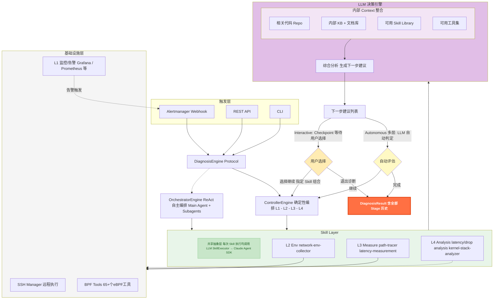
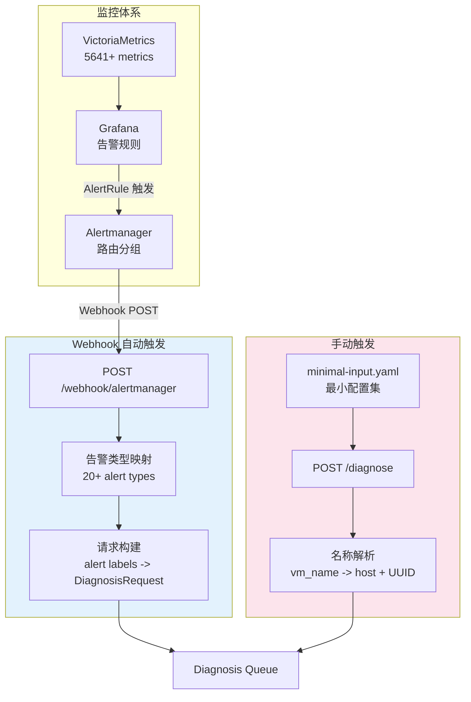
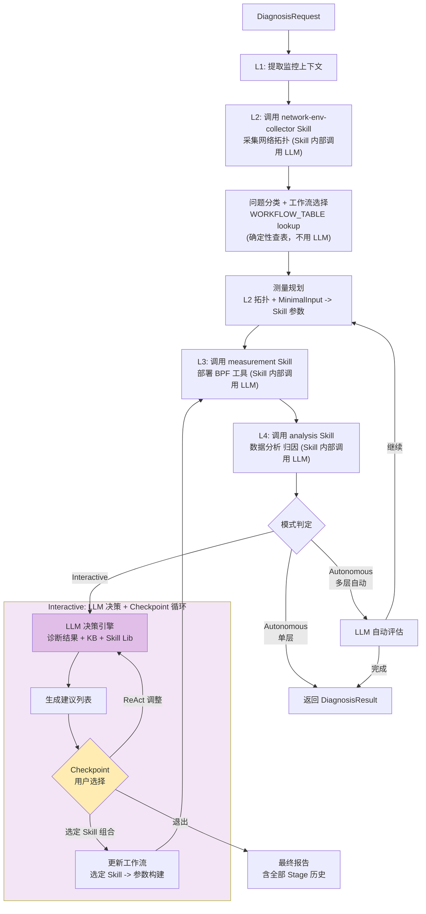
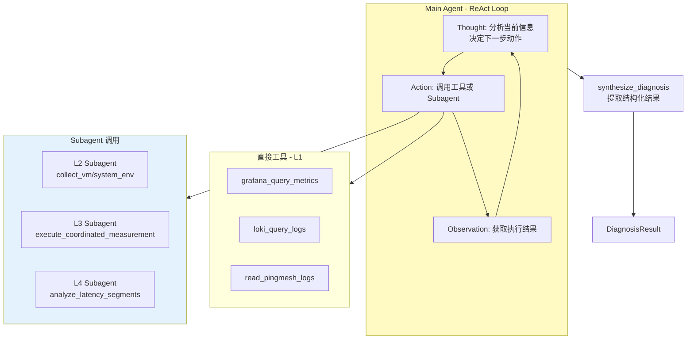
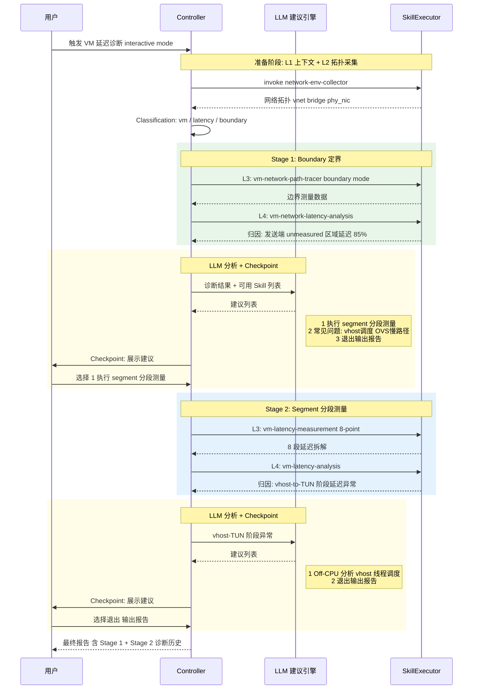
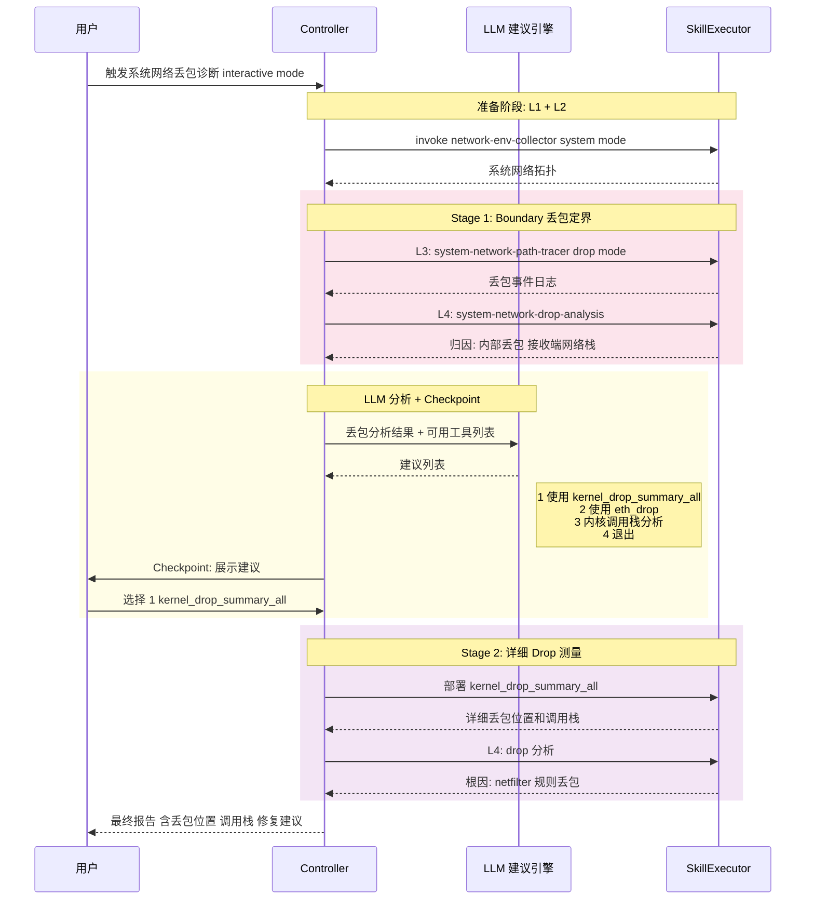

# NetSherlock 设计文档 v2

> 交接文档：从 65+ eBPF 工具到 AI 编排诊断平台的设计与实现

---

## 1. 设计概述

### 1.1 从工具集到智能平台

NetSherlock 项目的核心动机是解决一个实际矛盾：**我们已经拥有了 65+ 个覆盖全链路的 eBPF 网络测量工具（troubleshooting-tools），但工具能力越全面，使用复杂度越高**。一线运维人员需要同时掌握工具选择、参数配置、协调执行时序（如 receiver-first 约束）和多层结果解读——这些都是高度依赖专家经验的操作。

我们的目标是将分层诊断方法论编码为 AI Agent 的控制逻辑，实现 **"输入告警/配置 → 输出诊断报告"** 的端到端自动化，让工具能力保持不变的同时，彻底革新交互方式。

项目经历了从手动工具到智能平台的演进，以下是完整的进化全景：

```
Stage 0          Stage 1           Stage 2           Stage 3
────────         ────────          ────────          ────────
65+ eBPF 工具    10 Skills         智能编排           自主诊断
手动操作         自动执行           条件分支           ReAct Agent
专家经验         知识固化           LLM 辅助           自主决策
高认知负担       低使用门槛         人机协作           零干预

troubleshooting  NetSherlock       NetSherlock       NetSherlock
-tools           Phase 1           Phase 2           Phase 3

<────── 能力不变，交互革新 ──────>
<────── 工具层复用，控制层演进 ──────>
```

**当前状态**：Stage 1（Phase 1）已完成，Stage 2 的基础已具备。具体而言：

- **Stage 0 → Stage 1** 已完成：65+ 个底层工具被封装为 10 个可复用的 Skill，由 ControllerEngine 确定性编排，支持 5 种诊断工作流，覆盖 VM 和 System 网络的延迟/丢包场景。Webhook 集成 Alertmanager 实现告警自动触发。
- **Stage 1 → Stage 2** 基础就绪：Interactive 模式的 Checkpoint 机制和 LLM 建议引擎框架已实现（当前为规则驱动），OrchestratorEngine（ReAct）的 Agent 框架和工具层已就绪。后续接手可在此基础上引入 LLM 分析驱动的智能建议和多层递归诊断。

三个核心价值维度贯穿整个演进过程：
1. **降低使用门槛**：从 "需要理解 65+ 个工具" 到 "描述问题即可触发诊断"
2. **知识可复制**：专家的诊断经验编码在 Skill 定义和工作流编排中，团队共享
3. **闭环自动化**：监控告警 → 自动诊断 → 报告生成 → 推荐修复，完成可观测性闭环

### 1.2 设计原则

整个系统的设计遵循四个核心原则：

- **Skill 驱动**：将领域知识封装为可复用的诊断过程（Skill），而非让 AI 直接操作底层工具。每个 Skill 内部包含完整的协调逻辑（如 receiver-first 时序约束、8 点位 BPF 部署），编排层只需按名称调用 Skill 即可。选择这样设计是因为底层工具的操作复杂度不应暴露给编排引擎——无论是确定性 Controller 还是 ReAct Agent。

- **分层解耦**：L1-L4 各层通过明确的输入/输出契约连接，可独立演进。L2 拓扑采集的结果通过结构化映射转化为 L3 测量工具的参数，L3 的测量日志又作为 L4 分析的输入。层间依赖清晰、可测试。

- **渐进智能化**：确定性编排 → LLM 辅助 → 自主 Agent，按需演进而非一步到位。我们在 Phase 1 选择了 ControllerEngine（确定性编排）作为生产引擎，同时保留了 OrchestratorEngine（ReAct）的框架。这不是技术债，而是有意为之——在诊断类型有限（2-3 种）时，确定性编排的可靠性和可调试性远优于 LLM 自主决策。

- **Context 结构化**：Skill 的本质是将领域知识以结构化方式组织为模型可用的 context。L1-L2 层收集和组织环境信息（Layer 1 Context），L3 层通过主动测量获取深层数据（Layer 2 Context，通过 Action 获得），L4 层则在这些结构化 context 的基础上进行智能分析。这种视角贯穿整个架构设计——每增加一层 Skill，本质上是在为 LLM 提供更丰富、更结构化的诊断 context。

---

## 2. 系统架构

### 2.1 整体分层架构

系统采用五层架构：触发层、引擎层、Skill 层、LLM 决策引擎、基础设施层。以下是完整的架构图：



**各层职责说明**：

- **触发层**：三种入口统一为 `DiagnosisRequest`。Alertmanager Webhook 支持 20+ 告警类型自动映射，REST API 接受手动诊断请求，CLI 支持本地调试。所有入口通过 `DiagnosisEngine Protocol` 解耦，不依赖具体引擎实现。

- **引擎层**：两个引擎共享同一个 `DiagnosisEngine` 协议接口。ControllerEngine（确定性编排）是当前生产可用的引擎；OrchestratorEngine（ReAct 自主编排）是为未来准备的智能引擎。Webhook 层（`src/netsherlock/api/webhook.py`）通过协议接口与引擎交互，切换引擎无需修改 API 层代码。

- **Skill Layer**：共享抽象层，两个引擎共用同一套 Skill。每次 Skill 执行通过 `SkillExecutor` 调用 Claude Agent SDK，由 LLM 驱动实际的工具操作。Skill 内部封装了完整的领域知识——工具选择、参数构建、部署时序、结果解析。

- **LLM 决策引擎**：在 Interactive 模式下，L4 分析完成后由 LLM 综合诊断结果、知识库（KB）、Skill Library 和领域知识，生成结构化的下一步建议列表。在 Autonomous 模式下可由 LLM 自动判定是否需要下一层诊断。

- **基础设施层**：SSH Manager 管理远程执行连接池，BPF Tools 是 troubleshooting-tools 仓库中的 65+ 个 eBPF 工具，L1 监控通过 Grafana/VictoriaMetrics/Loki 提供基线数据和告警触发。

### 2.2 四层诊断模型

四层诊断模型源自 troubleshooting-tools 在实践中形成的分层诊断方法论。我们将其映射为 Agent 的 L1-L4 执行层：

| Layer | Tools / Skills | Purpose | Status |
|-------|---------------|---------|--------|
| L1 | `grafana_query_metrics`, `loki_query_logs`, `read_pingmesh_logs` | Base monitoring data：告警上下文、监控指标、历史日志 | ✅ |
| L2 | `collect_vm_network_env`, `collect_system_network_env` | Environment topology：网络拓扑采集（vnet、OVS bridge、物理网卡、QEMU PID） | ✅ |
| L3 | `execute_coordinated_measurement`, `measure_vm_latency_breakdown` | BPF measurement：eBPF 工具部署与协调执行（双端部署、receiver-first 时序） | ✅ |
| L4 | `analyze_latency_segments`, `generate_diagnosis_report` | Analysis & reporting：延迟归因、丢包定位、根因分析、修复建议 | ✅ |

从 Context 的视角来理解这四层的本质：

- **L1-L2 = Layer 1 Context 组织**：将环境信息（告警数据、网络拓扑、设备状态）收集并结构化，为后续测量提供参数依据。这些信息是"已有的"，只需收集和组织。
- **L3 = Layer 2 Context，通过 Action 获取**：某些诊断所需的信息无法从现有监控中获得，必须通过主动测量（部署 eBPF 工具）来获取。L3 的测量结果（延迟分布、丢包事件、调用栈）是只有通过 Action 才能得到的深层 Context。
- **L4 = Intelligence 分析闭环**：在充分的 Context（L1+L2 环境 + L3 测量）基础上，由 LLM 进行综合分析、归因计算和建议生成。这是 Context → Intelligence 的转化环节。

每一轮 L3→L4 的执行，本质上就是一次 **Context → Intelligence → Action** 的迭代。Interactive 模式下的多层诊断，就是多次这样的迭代。

### 2.3 触发与入口

系统支持两种触发方式：Webhook 自动触发和 REST API 手动触发。



**Webhook 自动触发**（已实现）：
- 与基础监控打通：Grafana 告警规则 → Alertmanager 路由 → Agent Webhook
- 告警标签自动映射：`src_host`, `src_vm`, `dst_host`, `dst_vm` 等 label 直接映射为 `DiagnosisRequest` 字段
- 支持 20+ 告警类型自动分类（如 `VMNetworkLatency` → `vm/latency`，`HostPacketLoss` → `system/packet_drop`）
- 自动判断诊断模式：已知告警类型走 Autonomous，未知类型走 Interactive
- 诊断结果持久化为 JSON 文件，通过 `GET /diagnose/{id}` 可查询

**手动触发**（已实现）：
- 通过 REST API（`POST /diagnose`）提交诊断请求
- 输入仅需最小配置集（`minimal-input.yaml`），包含目标环境的 IP 和 SSH 信息
- 支持 VM 名称解析：通过 `GlobalInventory` 自动查找 VM 所在的 host 和 UUID
- MinimalInputConfig 是参数的 "唯一真相源"，所有诊断参数均从中派生

---

## 3. 核心设计

### 3.1 Skill 体系与工具映射

Skill 是 NetSherlock 的核心抽象。每个 Skill 封装了一个完整的诊断过程——工具选择、参数构建、远程部署、协调执行、结果收集。编排引擎通过 `SkillExecutor` 按名称调用 Skill，无需了解内部实现细节。

**已实现 Skill 清单**：

| Skill | Layer | Purpose | Corresponding Tools |
|-------|-------|---------|-------------------|
| `network-env-collector` | L2 | VM/系统网络拓扑采集 | SSH + OVS/virsh 命令 |
| `vm-latency-measurement` | L3 | 8 点位 VM 全路径延迟测量 | icmp_path_tracer x 8 |
| `vm-network-path-tracer` | L3 | VM 边界延迟/丢包检测 | icmp_path_tracer x 2 |
| `system-network-path-tracer` | L3 | 主机间延迟/丢包检测 | system_icmp_path_tracer x 2 |
| `vm-latency-analysis` | L4 | 8 段延迟归因分析 | 数据解析 + 统计计算 |
| `vm-network-latency-analysis` | L4 | VM 边界延迟分析 | 日志解析 + 归因 |
| `vm-network-drop-analysis` | L4 | VM 丢包事件分析 | 丢包日志解析 + 定位 |
| `system-network-latency-analysis` | L4 | 主机间延迟分析 | 日志解析 + 归因 |
| `system-network-drop-analysis` | L4 | 主机间丢包分析 | 丢包日志解析 + 定位 |
| `kernel-stack-analyzer` | L4 | 内核调用栈分析 | GDB/addr2line 解析 |

**工具集到 Skill 的映射关系**：

```
troubleshooting-tools (65+ tools)         NetSherlock Skills (10)
┌──────────────────────────────┐         ┌──────────────────────┐
│ bcc-tools/                   │         │                      │
│  ├─ vm-network/              │         │                      │
│  │  ├─ icmp_path_tracer.py   │════════>│ vm-network-path-tracer│
│  │  ├─ tcp_path_tracer.py    │         │ vm-latency-measurement│
│  │  └─ ...                   │         │                      │
│  ├─ system-network/          │         │                      │
│  │  ├─ system_icmp_path_*.py │════════>│ system-network-path-  │
│  │  └─ ...                   │         │   tracer              │
│  ├─ drop/                    │         │                      │
│  │  ├─ eth_drop.py           │════════>│ kernel-stack-analyzer │
│  │  └─ kernel_drop_*         │         │                      │
│  └─ [per-layer tools × 27]  │         │ (Future Skills)      │
│                              │         │                      │
│ shell-scripts/               │         │                      │
│  └─ collect_network_env.sh   │════════>│ network-env-collector │
│                              │         │                      │
│ [分析脚本]                   │════════>│ *-analysis Skills     │
└──────────────────────────────┘         └──────────────────────┘
```

从 Context 的视角来看这个映射：测量工具 → Skills 的封装过程，本质上是将 Layer 2 Context（需要通过主动测量/追踪才能获得的深层诊断数据）组织为模型可用的结构化格式。65+ 个工具的原始输出（日志文件、时间戳序列、调用栈）经过 Skill 封装后，变为 LLM 能够理解和分析的结构化数据。

**SkillExecutor 的工作方式**：每次 Skill 调用通过 Claude Agent SDK 创建一个子 Agent，该 Agent 读取对应的 `SKILL.md` 文件（`.claude/skills/{skill-name}/SKILL.md`）获取执行指令，然后使用 Bash 工具执行实际的 SSH/BPF 操作。这种设计使得 Skill 的修改只需更新 SKILL.md 文件，无需改动 Python 代码。

### 3.2 工作流注册表

工作流注册表（WORKFLOW_TABLE）是 ControllerEngine 的核心调度机制。它将三个分类维度映射到具体的 Skill 组合：

**分类维度**：

- **NetworkType**：`system`（主机间网络）| `vm`（虚机间网络）
- **ProblemType**：`latency`（延迟异常）| `packet_drop`（丢包异常）| `connectivity`（连通性，未来）| `performance`（性能，未来）
- **DiagnosisMode**：`boundary` | `segment` | `event` | `specialized`

**模式说明**：

| Mode | Scope | Use Case | Dependency |
|------|-------|----------|------------|
| boundary | 边界点 (vnet↔phy) | 快速定界：内部 vs 外部 | 最小（仅需 host SSH） |
| segment | 全链路所有主要模块 | 精确定位：全分段延迟分解 | 中等（需 VM SSH） |
| event | 所有数据包事件 | 详细追踪：丢包事件、延迟异常 | 较高（需 root） |
| specialized | 特定模块/协议 | 深入分析：OVS datapath、TCP 重传 | 视情况而定 |

选择这四种模式是因为它们对应了实际排查中的自然递进关系：先定界（boundary）确定问题范围，再分段（segment）精确定位，然后追踪事件（event）找到具体丢包/异常，最后做专项分析（specialized）。这也是 Interactive 多层诊断的 escalation 路径。

**完整工作流矩阵**（已实现 + 规划中）：

| Network | Problem | Boundary | Segment | Event | Specialized |
|---------|---------|----------|---------|-------|-------------|
| system | latency | ✅ system-network-path-tracer | 📋 system-segment-tracer | 📋 packet-event-tracer | 📋 irq-latency-tracer |
| system | packet_drop | ✅ system-network-path-tracer | 📋 system-segment-tracer | 🔧 kfree-skb-tracer | 📋 tcp-retrans-tracer |
| vm | latency | ✅ vm-network-path-tracer | ✅ vm-latency-measurement | 📋 virtio-event-tracer | 📋 ovs-flow-collector |
| vm | packet_drop | ✅ vm-network-path-tracer | 📋 vm-drop-measurement | 🔧 kfree-skb-tracer | — |

状态标记：✅ 已实现, 🔧 部分实现, 📋 规划中

**WORKFLOW_TABLE 代码实现**：

```python
WORKFLOW_TABLE = {
    # (network_type, request_type, mode) → (measurement_skill, analysis_skill, param_builder)
    #
    # ========== Boundary Mode (边界定界) ==========
    ("system", "latency",     "boundary"): ("system-network-path-tracer", "system-network-latency-analysis", "_build_system_skill_params"),
    ("system", "packet_drop", "boundary"): ("system-network-path-tracer", "system-network-drop-analysis",    "_build_system_skill_params"),
    ("vm",     "latency",     "boundary"): ("vm-network-path-tracer",     "vm-network-latency-analysis",     "_build_vm_path_tracer_params"),
    ("vm",     "packet_drop", "boundary"): ("vm-network-path-tracer",     "vm-network-drop-analysis",        "_build_vm_path_tracer_params"),
    #
    # ========== Segment Mode (分段定界) ==========
    ("vm",     "latency",     "segment"):  ("vm-latency-measurement",     "vm-latency-analysis",             "_build_skill_params"),
}
```

**扩展模式**：新增诊断类型只需两步——注册 WORKFLOW_TABLE 条目 + 实现对应的 Skill 对（measurement + analysis）。例如：

```python
# 未来扩展
("vm", "latency",     "event"):       ("kfree-skb-tracer",    "kernel-stack-analyzer",  "_build_event_params"),
("vm", "performance", "specialized"): ("ovs-flow-collector",  "ovs-flow-analysis",      "_build_ovs_params"),
```

这是一个有意的简单设计：在诊断类型有限的阶段，一个 dict 查表比复杂的 WorkflowRegistry 类层次更直观、更易维护。当工作流数量增长到需要依赖检查、优先级排序和降级策略时，可以演进为 `diagnosis-workflow-architecture.md` 中设计的 `WorkflowRegistry` + `WorkflowSelector` 架构。

### 3.3 双引擎设计

系统实现了两个引擎，共享同一个 `DiagnosisEngine` 协议接口，但采用完全不同的编排范式。

#### ControllerEngine：确定性编排

ControllerEngine 是当前的生产引擎，316+ tests 覆盖。其内部流程：



**关键实现细节**：

- **编排层零 LLM 消耗**：Controller 的控制流（L1→L2→Classification→Plan→L3→L4）完全由 Python 代码驱动，不消耗 token。LLM 调用仅发生在 Skill 执行阶段（`SkillExecutor` → Claude Agent SDK）。
- **WORKFLOW_TABLE 查表**：问题分类和工作流选择通过 `_lookup_workflow()` 函数实现，是纯 Python 的 dict 查找，不涉及 LLM。
- **参数映射**：L2 拓扑采集的结果（vnet、OVS bridge、物理网卡）通过 `_build_*_params()` 方法自动映射为 L3 测量工具的参数，结合 `MinimalInputConfig` 中的 SSH 信息和 test IP。
- **每次 execute() 创建新的 DiagnosisController**：`ControllerEngine` 本身无状态，所有诊断状态（`DiagnosisState`）在 Controller 实例中管理。

这是当前生产可用的引擎，44 个测试文件、316+ test cases 覆盖了所有工作流路径、错误处理和边界条件。

#### OrchestratorEngine：ReAct 自主编排

OrchestratorEngine 采用 ReAct（Reasoning + Acting）范式，由 LLM 自主决策诊断流程：



**当前状态**：框架就绪，编排逻辑待完善。具体而言：
- ✅ Agent 框架和 ReAct 循环完整（`agents/orchestrator.py`）
- ✅ L1-L4 所有工具实现完整（17+ 工具通过 `ToolExecutor` 路由）
- ✅ 系统 Prompt 完善（含详细工作流指导和示例）
- 🔧 `_synthesize_diagnosis()` 为 placeholder，结果提取不完整
- 🔧 Subagent 结果解析待完善
- 🔧 无 MinimalInputConfig 加载逻辑
- 🔧 Alert → node config 映射缺失

后续接手如需启用 OrchestratorEngine，主要工作集中在结果合成和配置加载，Agent 框架本身已可运行。

#### 双引擎对比

| Dimension | ControllerEngine | OrchestratorEngine |
|-----------|-----------------|-------------------|
| 编排范式 | LangGraph-style 确定性图 | ReAct Loop 自主 Agent |
| 控制流 | Python 硬编码 L1→L2→L3→L4 | LLM 动态决策下一步 |
| Skill 选择 | WORKFLOW_TABLE 查表 | LLM 自主选择 |
| 可预测性 | 高（每次相同路径） | 低（LLM 可能跳过/重复步骤） |
| LLM 调用次数 | 3-4 次（仅 Skill 执行内部） | 5+ 次（编排层 + Skill 层均消耗） |
| Token 成本 | 编排层零消耗 | 编排层 + Skill 层双重消耗 |
| 当前状态 | ✅ Production-ready, 316+ tests | 🔧 框架就绪，编排待完善 |

**演进路径**：

| Phase | 诊断类型数 | 推荐引擎 | 理由 |
|-------|-----------|---------|------|
| Phase 1（2-3 种） | 当前 | ControllerEngine | 工作流固定，代码编排最可靠 |
| Phase 2（3-5 种） | 近期 | Controller + LLM 建议 | LLM 做跨工作流推荐，执行仍确定性 |
| Phase 3（5+ 种） | 远期 | OrchestratorEngine | 工作流组合爆炸，需 LLM 动态编排 |

从 Context×Action 闭环的角度理解这个演进：确定性编排 → ReAct 自主编排，本质上是 **Context 理解能力和 Action 决策能力的成熟度进阶**。在 Phase 1，我们用代码硬编码 Context→Action 的映射关系（WORKFLOW_TABLE）；Phase 2 引入 LLM 做建议但不做决策；Phase 3 才由 LLM 完全自主决策。每一步都建立在前一步积累的 Skill 和 Context 基础之上。

### 3.4 Interactive 多层诊断

Interactive 模式是 Phase 2 的核心能力，实现了人机协作的多层递归诊断。

#### Checkpoint 设计哲学

我们做了一个关键的设计决策：**Checkpoint 只在 LLM 给出建议后设置**，而不是在每个阶段之间都设置。

```
❌ 过多 Checkpoint:
   L1 → [CP] → L2 → [CP] → L3 → [CP] → L4 → [CP]

✅ 仅在决策点:
   L1 → L2 → L3 → L4 → [LLM 分析] → [CP: 展示建议]
                                              ↓ 选择继续
                          L3' → L4' → [LLM 分析] → [CP]
```

选择这样设计的原因：L1→L2→L3→L4 是一个完整的诊断过程，中间打断没有决策价值（用户无法在 L2 拓扑采集后做出有意义的决策）。真正需要人参与决策的时刻是 L4 分析出结果之后——此时 LLM 根据诊断结果和可用 Skill 列表给出结构化建议，用户在此做出判断。

**实现机制**：`CheckpointManager` 通过 `asyncio.Event` 实现等待，API 端点（`GET/POST /diagnose/{id}/checkpoint`）支持前端交互，CLI 模式通过回调函数直接与用户交互。

#### LLM 建议引擎

建议引擎的输入和输出设计：

**输入**：
- 当前 Stage 的诊断报告（结构化分析 + Markdown 报告）
- 测量原始数据（延迟分布、丢包事件、归因表）
- 知识库（KB）：kernel 网络栈、OVS 内部机制等领域知识
- 预定义 Skill Library：所有已注册 Skill 的能力描述和适用场景
- LLM 自身的网络诊断领域知识

**输出**（结构化建议列表）：每个选项包含推荐的 Skill 组合、参数配置和执行理由。

**当前状态**：建议生成是规则驱动的（`_generate_stage_suggestions()` 基于 WORKFLOW_TABLE 的 escalation 路径生成建议）。目标状态是由 LLM 综合分析后生成建议——这是后续接手的关键演进方向。

#### 场景 1: VM 延迟多层诊断

从 boundary 定界到 segment 分段测量的完整 Interactive 流程：



这个场景展示了 Interactive 模式的核心价值：Stage 1 的 boundary 定界发现 "发送端 unmeasured 区域延迟占比 85%"，但无法确定是 vhost 调度、TUN 处理还是 OVS 导致。用户选择 segment 分段测量后，Stage 2 将问题精确到 "vhost-to-TUN 阶段"。两个 Stage 的结果累积在最终报告中。

#### 场景 2: 系统网络丢包深入分析

从 boundary 丢包定界到详细 drop 测量工具的 Interactive 流程：



这个场景展示了从粗粒度定界到精确根因定位的过程：Stage 1 确定 "接收端网络栈内部丢包"，Stage 2 通过 `kernel_drop_summary_all` 工具获取具体的内核调用栈，最终定位到 netfilter 规则导致的丢包。

**贯穿两个场景的核心模式**：每一轮 L3→L4 的执行就是一次 Context→Intelligence→Action 的迭代。Stage 1 获取粗粒度 Context，Stage 2 获取细粒度 Context，每次迭代都在前一轮的基础上缩小问题范围、提高诊断精度。

---

## 4. 关键设计决策

### 4.1 为什么 Skill 驱动

### 4.2 为什么 MVP 选确定性编排

### 4.3 确定性 vs ReAct 的选择策略

### 4.4 MinimalInputConfig "唯一真相源"

---

## 5. 数据模型

### 5.1 DiagnosisRequest / DiagnosisResult

### 5.2 参数映射数据流

---

## 6. 当前状态与后续接手

### 6.1 实现进度总览

### 6.2 与原始设计的偏差

### 6.3 扩展指南

### 6.4 关键代码入口与依赖关系
