# NetSherlock: AI 驱动的智能网络诊断平台

> 从 65+ 个 eBPF 工具到一键智能诊断 —— 将专家经验编码为 AI Agent

---

## 1. 背景与动机

### 1.1 网络故障排查的核心挑战

在大规模虚拟化网络环境中，网络故障排查面临三重挑战：

| 挑战维度 | 具体表现 | 影响 |
|----------|---------|------|
| **路径复杂度** | VM → virtio → vhost → TUN/TAP → OVS → 物理网卡，跨 6+ 层网络栈 | 故障定位需逐层排查 |
| **工具专业性** | 65+ 个 eBPF 测量工具，各有不同参数、过滤条件和输出格式 | 对使用者要求极高 |
| **方法论门槛** | 需要 "先定界后详情" 的分层诊断经验，知道何时用何工具 | 经验难以传递和复制 |

### 1.2 已有工具集：能力强大但认知负担重

我们已经构建了一套覆盖全面、深度丰富的 eBPF 网络测量工具集（troubleshooting-tools），包含：

- **65+ 个 BPF 工具**：覆盖 VM/vhost/OVS/物理网卡全链路
- **3 层诊断模型**：Summary（统计概览）→ Details（逐包追踪）→ Root Cause（根因分析）
- **成熟的方法论**：两阶段排查（定界 → 详情），事件驱动的开销模型

```
工具集能力矩阵：

                    延迟诊断    丢包检测    性能度量    专项分析
  ┌─────────────┬──────────┬──────────┬──────────┬──────────┐
  │ System 网络  │ ✅ 4工具  │ ✅ 4工具  │ ✅ 4工具  │ ✅ CPU/锁 │
  │ VM 网络     │ ✅ 4工具  │ ✅ 4工具  │ ✅ 4工具  │ ✅ OVS    │
  │ 各层单点    │ ✅ 27工具 │ ✅ 6工具  │          │ ✅ vhost  │
  └─────────────┴──────────┴──────────┴──────────┴──────────┘
```

**核心矛盾**：工具能力越全面，使用复杂度越高。一线运维人员需要掌握的知识包括：
- 选择正确的工具组合（哪个网络类型？哪种问题？哪种模式？）
- 配置正确的参数（SSH 信息、过滤条件、时长、阈值）
- 理解多工具的协调执行（receiver-first 约束、8 点位部署时序）
- 解读和关联多层测量结果（延迟归因、丢包定位）

### 1.3 智能化的必要性与目标

**核心目标**：将分层诊断方法论编码为 AI Agent 的控制逻辑，实现 **"输入告警/配置 → 输出诊断报告"** 的端到端自动化。


**三个价值维度**：

1. **降低使用门槛**：从 "需要理解 65+ 个工具" 到 "描述问题即可触发诊断"
2. **知识可复制**：专家的诊断经验编码在 Skill 定义和工作流编排中，团队共享
3. **闭环自动化**：监控告警 → 自动诊断 → 报告生成 → 推荐修复，完成可观测性闭环

---

## 2. 方法论基础

### 2.1 三层诊断模型

troubleshooting-tools 在实践中形成了一套成熟的分层诊断方法论：

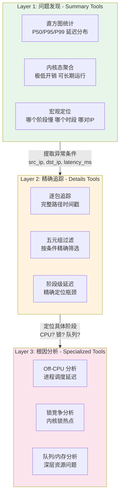

**关键设计原则**：
- **低开销优先**：Summary 工具使用内核态 BPF Histogram 聚合，开销极低
- **过滤驱动**：开销取决于过滤后提交到用户态的事件数，而非原始流量
- **逐层深入**：每一层的输出为下一层提供过滤条件，控制分析范围

### 2.2 从方法论到可编程工作流

三层诊断模型的结构化特性，使其天然适合自动化编排：

| 方法论层次 | 对应 Agent 层 | 自动化要素 |
|-----------|--------------|-----------|
| Layer 1: Summary 发现 | **L1: Base Monitoring** | Grafana/Loki 查询 → 异常检测 |
| Layer 2: Details 追踪 | **L2: 环境感知** + **L3: 精确测量** | 拓扑采集 → 工具部署 → 协调执行 |
| Layer 3: Root Cause 分析 | **L4: 诊断分析** | 数据解析 → 归因计算 → 报告生成 |

**关键洞察**：诊断工作流的每一步都有明确的输入/输出契约，这使得我们可以将每一步封装为独立的 **Skill**，由 Agent 按照方法论编排执行。

### 2.3 两阶段排查法的 Agent 映射

```
人工排查流程:                          Agent 自动化流程:
┌──────────────────┐                  ┌──────────────────┐
│ 阶段1: 定界       │                  │ Boundary Mode     │
│ "问题在内部还是外部？" │      ══►      │ path_tracer 部署   │
│ 使用 path_tracer  │                  │ 双端协调执行       │
│ 判断丢包/延迟位置  │                  │ 自动归因分析       │
└──────┬───────────┘                  └──────┬───────────┘
       │ 内部问题                              │ 自动判定
       ▼                                      ▼
┌──────────────────┐                  ┌──────────────────┐
│ 阶段2: 详情       │                  │ Segment Mode      │
│ "具体哪个阶段慢？"  │      ══►       │ 8点位 BPF 部署     │
│ 使用 details 工具  │                  │ 全路径延迟拆解     │
│ 专家解读数据      │                  │ LLM 辅助根因分析   │
└──────────────────┘                  └──────────────────┘
```

---

## 3. 系统架构

### 3.1 整体分层架构

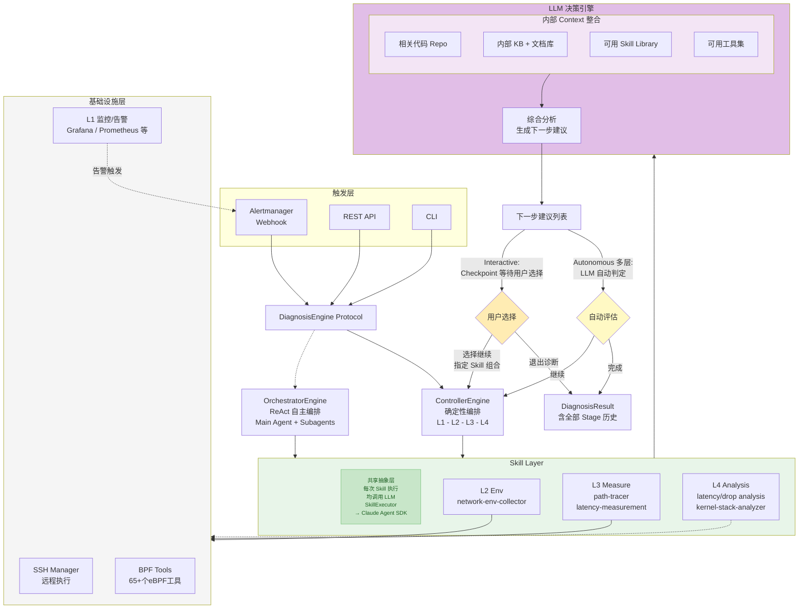

### 3.2 核心诊断数据流：Skill 输出后的模式分支

两个引擎都通过 Skill Layer 执行测量和分析，**关键差异在 Skill 输出之后的处理逻辑**：

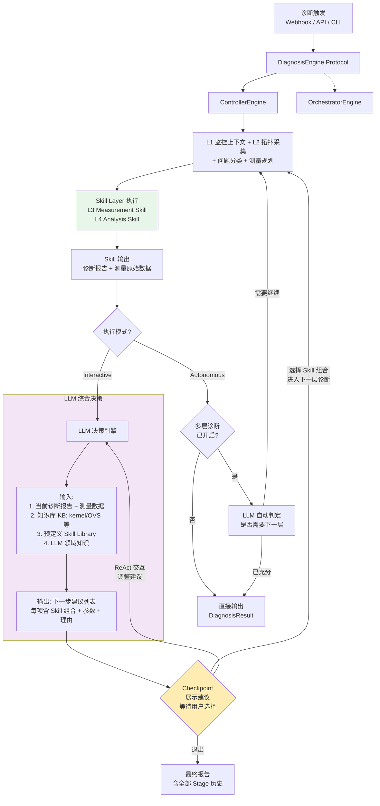

**数据流说明**：

1. **Skill Layer 执行后**，输出两类数据：诊断报告（结构化分析结果）和测量原始数据（日志文件、时间戳）

2. **Interactive 模式**：
   - Skill 输出 → **LLM 决策引擎**综合分析：诊断报告 + 测量数据 + 内部知识库（kernel/OVS 源码知识等）+ 预定义 Skill Library + LLM 自身领域知识
   - 输出结构化的**下一步建议列表**，每项包含推荐的 Skill 组合、参数配置、执行理由
   - 在 **Checkpoint** 处展示建议，用户可选择执行、通过 ReAct 交互调整方案、或退出
   - 选择执行后，回到 Controller 主逻辑，用选定的 Skill 组合进行下一轮 L3+L4
   - **整个循环可多层嵌套**：Stage 1 → Stage 2 → Stage 3 → ...

3. **Autonomous 模式**：
   - Skill 输出 → 直接返回 DiagnosisResult（默认行为）
   - 若开启**多层自动诊断选项**：LLM 自动判定是否需要下一层，无需人工确认，自动进入下一轮

### 3.3 双引擎对比

| 对比维度 | ControllerEngine | OrchestratorEngine |
|----------|-----------------|-------------------|
| **编排范式** | LangGraph 风格（确定性图） | ReAct Loop（自主 Agent） |
| **控制流** | Python 硬编码序列 L1→L2→L3→L4 | LLM 动态决策下一步动作 |
| **Skill 选择** | WORKFLOW_TABLE 确定性查表 | LLM 自主决定调用哪个 Skill/工具 |
| **可预测性** | 高（每次相同路径） | 低（LLM 可能跳过/重复步骤） |
| **AI 调用次数** | 3-4 次（Skill 执行时调用 LLM） | 5+ 次（Main Agent 决策 + Subagent Skill） |
| **Token 成本** | 编排层零 LLM，Skill 执行时产生 LLM 消耗 | 编排层 + Skill 层均消耗 Token |
| **适用场景** | 固定工作流、单类型诊断 | 复杂多类型、需动态策略调整 |
| **当前状态** | ✅ 完整实现，316 tests | 🔧 框架 + 工具就绪，Subagent 编排待完善 |

### 3.4 ControllerEngine 详解

ControllerEngine 是当前的核心引擎。其内部流程在不同模式下的差异：

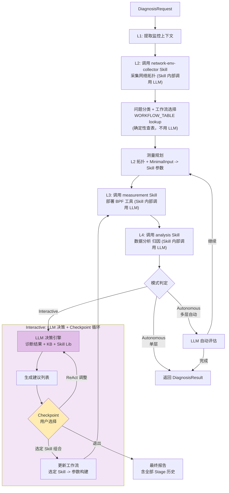

#### LLM 决策引擎的输入与输出

**输入**：
- 当前 Stage 的诊断报告（结构化分析 + Markdown 报告）
- 测量原始数据（延迟分布、丢包事件、归因表）
- 知识库（KB）：kernel 网络栈、OVS 内部机制等领域知识
- 预定义 Skill Library：所有已注册 Skill 的能力描述和适用场景
- LLM 自身的网络诊断领域知识

**输出**（结构化建议列表）：

```
分析摘要: "发送端主机内部延迟占比 85%, 未测量区域(虚拟化/VM内部)贡献显著"

建议选项:
  1. [执行分段测量] -> vm-latency-measurement Skill (segment mode, 8点位)
     理由: 当前 boundary 模式无法区分虚拟化各层, segment 模式可拆解 8 个阶段
  2. [常见问题排查] -> 提供 vhost 线程调度、OVS 慢路径等常见原因及排查方法
  3. [执行 drop 检测] -> system-network-path-tracer (packet_drop mode)
     理由: 高延迟可能伴随丢包, 建议同步检测
  4. [退出] -> 输出当前报告
```

### 3.5 OrchestratorEngine: ReAct 自主编排

OrchestratorEngine 采用 ReAct（Reasoning + Acting）范式，由 LLM 自主决策诊断流程。与 ControllerEngine 不同，**Orchestrator 不使用 WORKFLOW_TABLE**，而是由 LLM 根据上下文自主决定调用哪些工具和 Subagent：

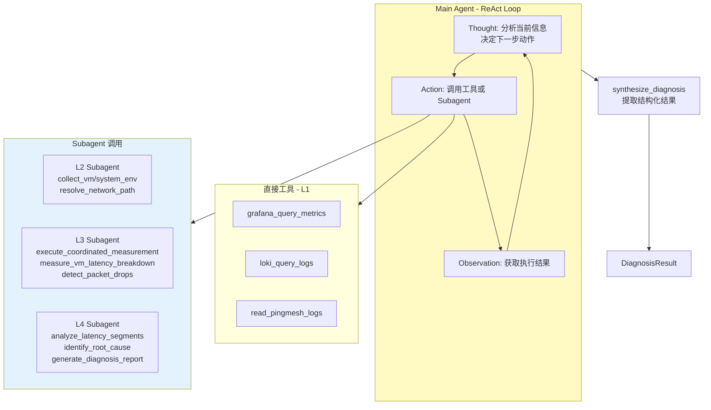

**Orchestrator 的诊断流程**：

1. **接收请求**：通过 `diagnose_alert()` 或 `diagnose_request()` 入口
2. **构建 Agent**：加载系统 Prompt（含完整工作流指导、工具描述、问题类型决策树）
3. **ReAct 循环**（LLM 自主决策，不依赖 WORKFLOW_TABLE）：
   - LLM 分析告警/请求信息，自主决定先查询哪些监控数据（L1 工具）
   - 根据 L1 结果自主判断需要采集哪些环境信息（invoke L2 Subagent）
   - 自主规划测量方案并执行（invoke L3 Subagent）
   - 分析测量结果生成诊断报告（invoke L4 Subagent）
4. **结果合成**：从 Agent 输出中提取结构化 JSON，构建 `DiagnosisResult`

**当前状态**：
- ✅ Agent 框架和 ReAct 循环完整
- ✅ L1-L4 所有工具实现完整（17+ 工具通过 ToolExecutor 路由）
- ✅ 系统 Prompt 完善（含详细工作流指导和示例）
- ✅ 结果合成逻辑完整（JSON 解析 + 文本 fallback）
- 🔧 Subagent 结果解析待完善（`_parse_environment/measurement/diagnosis()` 需补充）

### 3.6 交互模式总览

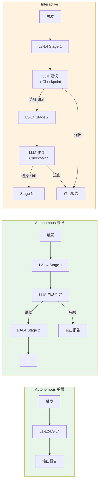

### 3.7 触发方式

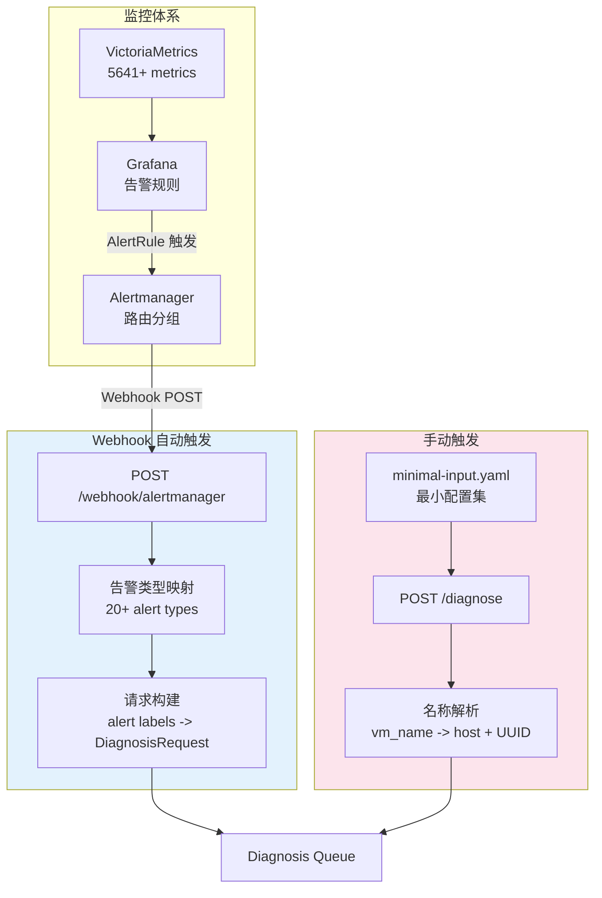

**Webhook 自动触发**：
- 与基础监控打通（Grafana → Alertmanager → Agent）
- 告警标签自动映射：`src_host`, `src_vm`, `dst_host`, `dst_vm`
- 支持 20+ 告警类型自动分类（VMNetworkLatency → latency, HostPacketLoss → packet_drop）
- 自动判断诊断模式（已知告警 → Autonomous，未知 → Interactive）

**手动触发**：
- 通过 REST API 提交诊断请求
- 输入仅需最小配置集（目标环境 IP + SSH 信息）
- 支持 VM 名称解析（通过 GlobalInventory 自动查找 host/UUID）

---

## 4. 核心数据流

### 4.1 告警驱动自动诊断流（Autonomous Mode）

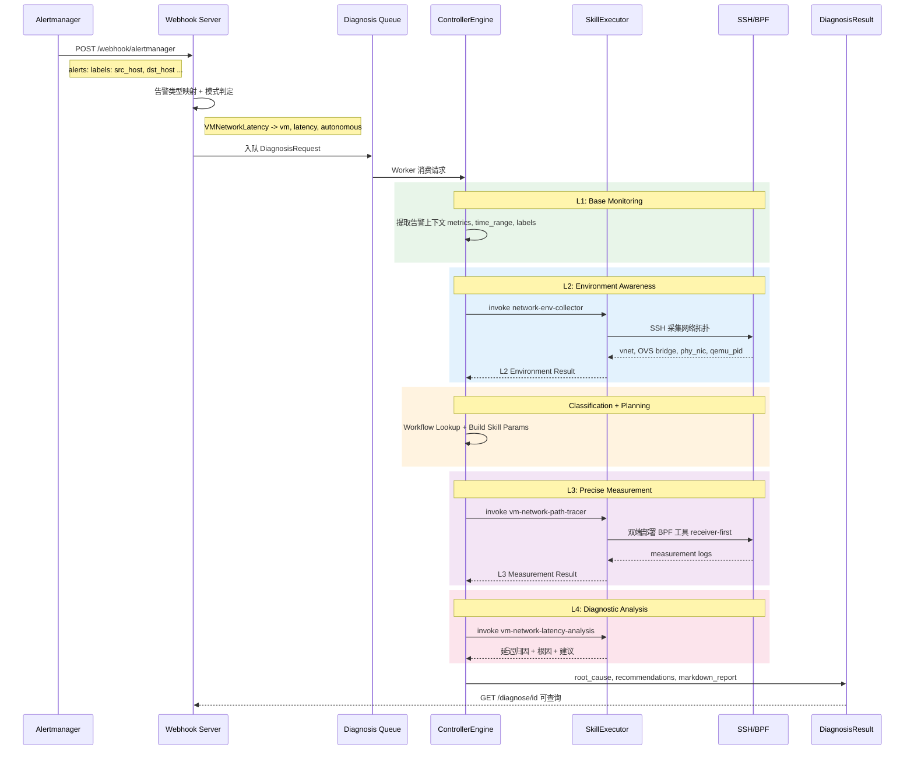

### 4.2 Interactive 诊断流：场景一 —— VM 延迟多层递归

从 boundary 定界到 segment 分段测量的完整 Interactive 流程：

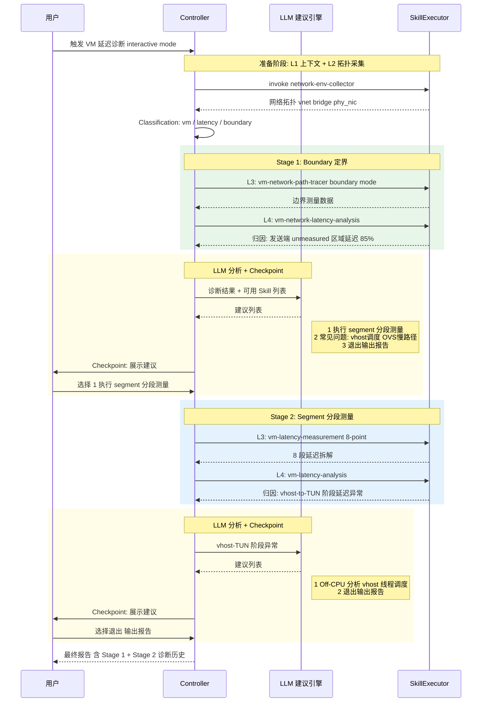

### 4.3 Interactive 诊断流：场景二 —— 系统网络丢包深入分析

从 boundary 丢包定界到详细 drop 测量工具的 Interactive 流程：

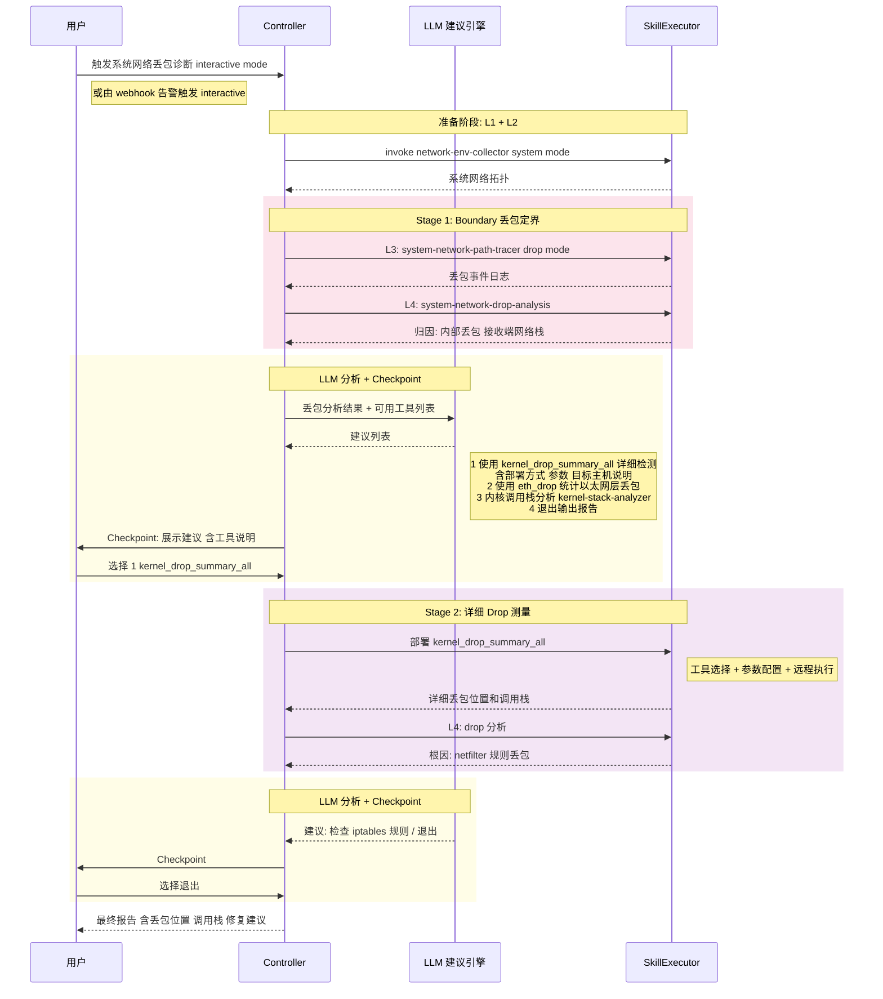

### 4.4 参数映射数据流（L2 → L3）

Skill 之间的数据流转是系统的关键设计：

```
L2 网络拓扑采集结果:                          L3 测量工具参数:
┌─────────────────────────────┐            ┌─────────────────────────────┐
│ src_env:                    │            │ sender_host_ssh: "root@..."  │
│   vm_uuid: "abc-123"       │   ═══►     │ sender_vm_ip: "10.0.0.1"    │
│   qemu_pid: 12345          │  自动映射   │ sender_vnet: "vnet0"        │
│   nics:                    │            │ sender_phy_nic: "eth0"       │
│     - host_vnet: "vnet0"   │            │ receiver_host_ssh: "root@..." │
│       ovs_bridge: "ovsbr"  │            │ receiver_vm_ip: "10.0.0.2"   │
│       physical_nics:       │            │ receiver_vnet: "vnet1"       │
│         - name: "eth0"     │            │ receiver_phy_nic: "eth0"     │
│                            │            │ duration: 30                 │
│ MinimalInputConfig:        │            │ protocol: "icmp"             │
│   test_ip: "10.0.0.1"     │            │ local_tools_path: "/path/..."│
│   ssh.host: "192.168.1.10"│            └─────────────────────────────┘
└─────────────────────────────┘
```

**设计要点**：
- `test_ip`（业务网络 IP）和 `ssh.host`（管理网络 IP）可以不同
- L2 采集的拓扑信息（vnet、bridge、phy_nic）自动映射为 L3 工具参数
- MinimalInputConfig 是 "唯一真相源"，所有诊断参数均从中派生

---

## 5. 关键设计考量

### 5.1 为什么选择 Skill 驱动架构

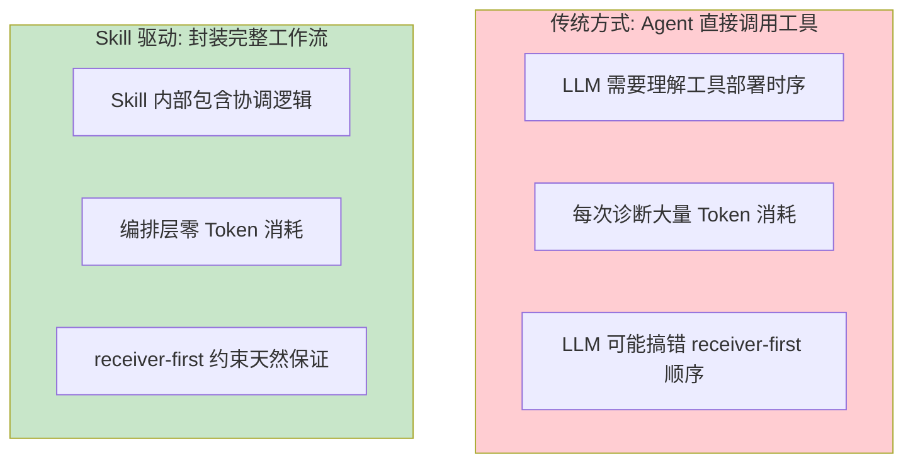

**核心原因**：
1. **复用已有 Skills**：network-env-collector、vm-latency-measurement 等已经过实战验证
2. **封装领域知识**：receiver-first 时序约束、8 点位部署逻辑都在 Skill 内部
3. **成本可控**：编排层（Controller）不调用 LLM，LLM 消耗集中在 Skill 执行阶段（SkillExecutor → Claude Agent SDK），路径确定性高

### 5.2 工作流注册表的可扩展性（ControllerEngine 专属）

```python
# 当前已注册工作流
WORKFLOW_TABLE = {
    # System 网络 (主机间)
    ("system", "latency",     "boundary"): ("system-network-path-tracer", "system-network-latency-analysis"),
    ("system", "packet_drop", "boundary"): ("system-network-path-tracer", "system-network-drop-analysis"),

    # VM 网络 - Boundary Mode (仅 host 部署)
    ("vm", "latency",     "boundary"): ("vm-network-path-tracer", "vm-network-latency-analysis"),
    ("vm", "packet_drop", "boundary"): ("vm-network-path-tracer", "vm-network-drop-analysis"),

    # VM 网络 - Segment Mode (8点位全路径)
    ("vm", "latency", "segment"): ("vm-latency-measurement", "vm-latency-analysis"),
}
```

**扩展方式**：新增诊断类型只需注册新条目 + 实现对应 Skill：

```python
# 未来扩展示例
("vm", "latency",     "event"):       ("kfree-skb-tracer",    "kernel-stack-analyzer"),
("vm", "performance", "specialized"): ("ovs-flow-collector",  "ovs-flow-analysis"),
("system", "latency", "specialized"): ("irq-latency-tracer",  "irq-analysis"),
```

### 5.3 Interactive Checkpoint 设计哲学

Interactive 模式的核心设计决策：**Checkpoint 只在 LLM 给出建议后设置**。

```
❌ 不这样做 (过多 Checkpoint, 打断流程):
   L1 → [CP] → L2 → [CP] → Classification → [CP] → L3 → [CP] → L4 → [CP]

✅ 这样做 (仅在决策点 Checkpoint):
   L1 → L2 → Classification → L3 → L4 → [LLM 分析] → [CP: 展示建议, 等待选择]
                                                              ↓ 选择继续
                                          L3' → L4' → [LLM 分析] → [CP]
```

**设计原则**：
- **Checkpoint = LLM 建议节点**：只有当 LLM 分析完结果并给出结构化建议时才暂停
- **建议包含上下文**：每个选项附带工具说明、参数配置、预期效果
- **支持 ReAct 交互**：用户可在 Checkpoint 处要求 LLM 调整建议（换方案、改参数）
- **退出随时可用**：每个 Checkpoint 都包含退出选项，输出当前已有的诊断报告
- **结果累积**：多层诊断的所有 Stage 结果自动累积到最终报告中

### 5.4 确定性编排 vs ReAct 自主的选择策略

两种引擎不是竞争关系，而是**渐进演进路径**：

| 阶段 | 诊断类型数 | 推荐引擎 | 原因 |
|------|-----------|---------|------|
| Phase 1 | 2-3 种 | Controller | 工作流固定，代码编排最可靠 |
| Phase 2 | 3-5 种 | Controller + LLM 建议 | 用 LLM 做跨工作流推荐，执行仍确定性 |
| Phase 3 | 5+ 种 | Orchestrator | 工作流组合爆炸，需要 LLM 动态编排 |

**关键洞察**：Interactive 模式下的 ControllerEngine + LLM 建议引擎，实际上是一种 **"受控的 ReAct"** —— 在确定性框架内引入智能决策，兼顾可靠性和灵活性。

---

## 6. Skill 体系与工具映射

### 6.1 已实现 Skill 清单

| Skill | 层次 | 用途 | 对应工具 |
|-------|------|------|---------|
| `network-env-collector` | L2 | 采集 VM/系统网络拓扑 | SSH + OVS/virsh 命令 |
| `vm-latency-measurement` | L3 | 8 点位 VM 延迟测量 | icmp_path_tracer x 8 |
| `vm-network-path-tracer` | L3 | VM 边界延迟/丢包检测 | icmp_path_tracer x 2 |
| `system-network-path-tracer` | L3 | 主机间延迟/丢包检测 | system_icmp_path_tracer x 2 |
| `vm-latency-analysis` | L4 | 8 段延迟归因分析 | 数据解析 + 统计计算 |
| `vm-network-latency-analysis` | L4 | VM 边界延迟分析 | 日志解析 + 归因 |
| `vm-network-drop-analysis` | L4 | VM 丢包事件分析 | 丢包日志解析 + 定位 |
| `system-network-latency-analysis` | L4 | 主机间延迟分析 | 日志解析 + 归因 |
| `system-network-drop-analysis` | L4 | 主机间丢包分析 | 丢包日志解析 + 定位 |
| `kernel-stack-analyzer` | L4 | 内核调用栈分析 | GDB/addr2line 解析 |

### 6.2 工具集到 Skill 的映射关系

```
troubleshooting-tools (65+ tools)         NetSherlock Skills (10)
┌──────────────────────────────┐         ┌──────────────────────┐
│ bcc-tools/                   │         │                      │
│  ├─ vm-network/              │         │                      │
│  │  ├─ icmp_path_tracer.py   │════════>│ vm-network-path-tracer│
│  │  ├─ tcp_path_tracer.py    │         │ vm-latency-measurement│
│  │  ├─ latency_summary.py    │         │                      │
│  │  └─ latency_details.py    │         │                      │
│  ├─ system-network/          │         │                      │
│  │  ├─ system_icmp_path_*.py │════════>│ system-network-path-  │
│  │  ├─ latency_summary.py    │         │   tracer              │
│  │  └─ latency_details.py    │         │                      │
│  ├─ drop/                    │         │                      │
│  │  ├─ eth_drop.py           │════════>│ kernel-stack-analyzer │
│  │  ├─ kernel_drop_summary_* │         │ (未来: drop-measurement│
│  │  └─ kernel_drop_details_* │         │  Skill)              │
│  └─ [per-layer tools x 27]  │         │ (Future Skills)      │
│                              │         │                      │
│ shell-scripts/               │         │                      │
│  └─ collect_network_env.sh   │════════>│ network-env-collector │
│                              │         │                      │
│ [分析脚本]                   │════════>│ *-analysis Skills     │
└──────────────────────────────┘         └──────────────────────┘
```

---

## 7. 已有实现与现状

### 7.1 实现进度

| 模块 | 状态 | 说明 |
|------|------|------|
| DiagnosisController | ✅ 完整 | 确定性编排，支持 5 种工作流，Autonomous + Interactive |
| SkillExecutor | ✅ 完整 | Claude Agent SDK Skill 调用 |
| Webhook Server | ✅ 完整 | FastAPI, Alertmanager 集成, 20+ 告警类型映射 |
| MinimalInputConfig | ✅ 完整 | YAML 配置解析与验证 |
| GlobalInventory | ✅ 完整 | 资产管理 + VM 名称解析 |
| Checkpoint System | ✅ 基础 | 支持 3 种 Checkpoint 类型，规则化建议 |
| LLM 建议引擎 | 🔧 演进中 | 当前规则驱动，正向 LLM 分析驱动演进 |
| Schemas (Request/Result) | ✅ 完整 | 统一数据模型 |
| 10 Claude Skills | ✅ 完整 | L2/L3/L4 全链路 |
| Orchestrator (ReAct) | 🔧 框架 | Agent 框架 + 17 工具就绪，Subagent 编排待完善 |
| Web 前端 | 🔧 基础 | React 19 + Tailwind, 基础页面 |

### 7.2 测试覆盖

```
测试分布:
  ├── 单元测试 x31 ─── Controller, Schemas, Skills, Config, Tools
  ├── 集成测试 x8  ─── CLI->Controller, Webhook->Engine, Dual-mode, Error handling
  └── 总计: 44 test files, 316+ test cases
```

### 7.3 已支持的诊断场景

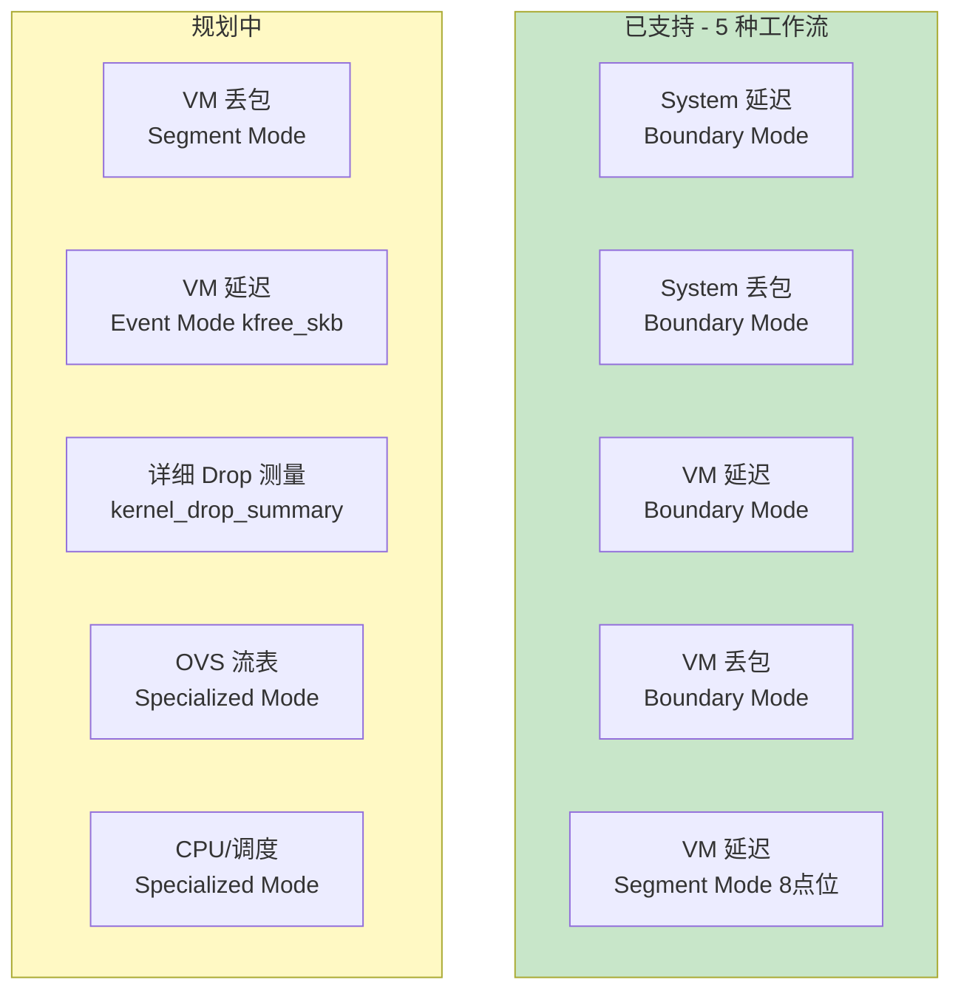

---

## 8. 演进路线

### 8.1 三阶段演进

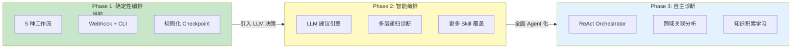

**Phase 1 → Phase 2 的关键变化**：

| 维度 | Phase 1 (当前) | Phase 2 (目标) |
|------|---------------|---------------|
| Checkpoint 建议 | 规则驱动（仅 boundary→segment） | LLM 分析驱动（结合诊断结果 + Skill 列表） |
| 诊断深度 | 单层诊断 | 多层递归（boundary → segment → specialized） |
| 跨类型推荐 | 无 | 延迟诊断后建议检查丢包，丢包后建议查调用栈 |
| Drop 工具支持 | boundary 定界 | 详细 drop 工具选择与部署（新增 Skill） |

### 8.2 从工具集到智能平台的完整进化

```
┌─────────────────────────────────────────────────────────────────────┐
│                      演进全景图                                      │
│                                                                     │
│  Stage 0          Stage 1           Stage 2           Stage 3      │
│  ────────         ────────          ────────          ────────      │
│                                                                     │
│  65+ eBPF 工具    10 Skills         智能编排           自主诊断     │
│  手动操作         自动执行           条件分支           ReAct Agent  │
│  专家经验         知识固化           LLM 辅助           自主决策     │
│  高认知负担       低使用门槛         人机协作           零干预       │
│                                                                     │
│  troubleshooting  NetSherlock       NetSherlock       NetSherlock  │
│  -tools           Phase 1           Phase 2           Phase 3      │
│                                                                     │
│  <────── 能力不变，交互革新 ──────>                                  │
│  <────── 工具层复用，控制层演进 ──────>                               │
└─────────────────────────────────────────────────────────────────────┘
```

---

## 附录 A: 技术栈

| 组件 | 技术选型 |
|------|---------|
| Agent Framework | Claude Agent SDK |
| 后端 | Python 3.11+, FastAPI, Pydantic |
| 前端 | React 19, TypeScript, Tailwind CSS, Vite |
| 测量工具 | BCC/eBPF (Python), bpftrace |
| 监控集成 | Grafana, VictoriaMetrics, Loki, Alertmanager |
| 远程执行 | SSH (asyncssh) |
| 配置管理 | YAML (MinimalInputConfig), Env vars (Pydantic Settings) |
| 测试 | pytest, 316+ test cases |

## 附录 B: 关键数据模型

### DiagnosisRequest

```python
DiagnosisRequest:
  request_id: str              # 唯一请求标识
  request_type: latency | packet_drop | connectivity
  network_type: vm | system
  src_host: str                # 源主机
  dst_host: str | None         # 目标主机
  src_vm: str | None           # 源虚拟机
  dst_vm: str | None           # 目标虚拟机
  source: CLI | WEBHOOK | API  # 触发来源
  mode: AUTONOMOUS | INTERACTIVE
  alert: AlertPayload | None   # 原始告警
  options: dict                # 扩展选项 (duration, segment, etc.)
```

### DiagnosisResult

```python
DiagnosisResult:
  diagnosis_id: str
  status: PENDING | RUNNING | WAITING | COMPLETED | ERROR
  started_at / completed_at: datetime

  # 诊断结论
  summary: str                 # 诊断摘要
  root_cause: RootCause        # 根因 (category, description, evidence)
  recommendations: [Recommendation]  # 修复建议 (priority, action, rationale)
  confidence: float            # 置信度 0-1

  # 各层数据
  l1_observations: dict        # 监控数据
  l2_environment: dict         # 网络拓扑
  l3_measurements: dict        # 测量结果
  l4_analysis: dict            # 分析详情

  # 报告产物
  markdown_report: str         # Markdown 格式报告
  report_path: str             # 报告文件路径
  checkpoint_history: list     # Interactive 模式: 各 Stage 决策记录
```
